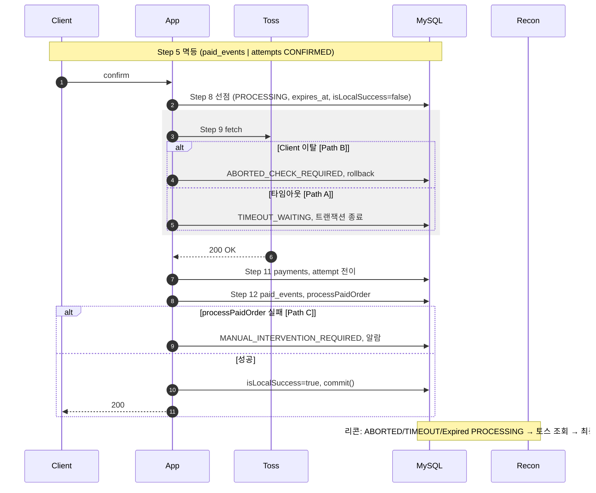

# 결제 엔진 설계: 주문 완료·뒤로가기/재결제 방지 (통합 명세)

**목적**: Gemini 1~13차 + Step A-1/A-2 피드백을 반영한 **채택 설계·실행 지침·DDL·confirm 흐름**만 정리. 구현 시 참조용.

---

## 1. 설계 방향 요약

| 영역 | 채택 내용 |
|------|-----------|
| **Idempotency** | 서버 발급 CheckoutSessionKey만. DB/Redis, expires_at+인덱스, GC 또는 TTL. 키 발급 시 장바구니 해시/금액 저장, POST /orders 시 대조 후 불일치 409. |
| **결제 시도·Saga** | payment_attempts 선점(PROCESSING) → 토스 fetch → 결과 반영. 선점 5~10분. attempt_seq는 DB UNIQUE+원자 부여. |
| **리콘** | 토스 조회 후에만 동기화. 3자 대조(토스↔attempt↔paid_events). 불일치 시 알림+잠금. RECON_PROCESSING 원자 전이로 점유. DB 반영 실패 시 MANUAL_INTERVENTION_REQUIRED+알림. |
| **Pool·래퍼** | createPool + Connection Injection, Single Owner. release 실패 시 exit 방지. |
| **타임아웃** | Proxy > App > Toss. 타임아웃 시 TIMEOUT_WAITING 기록, 리콘 위임. **즉시 롤백 후 종료 금지.** |
| **클라이언트 이탈** | req.on('close'), AbortController. **isLocalSuccess = true는 await connection.commit()이 성공적으로 resolve된 직후에만.** 이탈 시 abort+플래그, 메인/catch에서 ABORTED_CHECK_REQUIRED·rollback. |
| **재고 Hold** | stock_holds 별도 테이블. 오버 홀딩 방지: INSERT 시 stock_units **FOR UPDATE** 또는 (stock_unit_id, status) 부분 유니크. 5~10분 미니 배치. |
| **페이로드** | payment_attempts는 메타만. payment_payloads 1:1 분리. ON DELETE RESTRICT. |
| **비회원** | Fingerprint 권장. 기본: 불일치 시 결제 차단·재인증. 쿠키는 리콘까지 유지. |

**버림/부분수용**: 클라이언트 uuid idempotency. orders (user_id, status) UNIQUE 유지. Fingerprint 무조건 403은 안 함.

---

## 2. 실행 지침 (Strict Guide)

구체 수식·쿼리 예시는 **§5 구현 규칙** 참고.

| 블록 | 지침 |
|------|------|
| **Idempotency·리콘** | 서버 발급 키만, expires_at+GC, 장바구니 대조 409. 리콘: 토스 조회 후만 동기화, RECON_PROCESSING CAS, **expires_at &lt; NOW()-1분** Safety Buffer, **최근 5분 ABORTED/TIMEOUT** 우선. commit In-doubt 시 리콘 우선 처리. **PG 전수 조사**(PG API 지원 시): 주기적으로 PG 성공 내역 조회 후 우리 DB와 대조, 기록 없는 유령 결제 복구 또는 에스컬레이션. |
| **Pool·커넥션** | createPool, **withTransaction/withConnection만** 사용, **release()**는 래퍼 내부만. **connection.end() 금지**. confirm당 **Conn A**(선점)→release → **Fetch(커넥션 없음)** → **Conn B**(결과 반영). **예약 N**: (pool_size−N)은 **Conn B·웹훅·리콘**이 공유. **503 입장 제어는 confirm(Conn A) 요청에만** 적용 — 웹훅은 동일 제한으로 차단하지 않음(웹훅 고립 방지). activePayments 또는 Conn A 단계 수가 (pool_size−N) 이상이면 **신규 confirm만** 503. **getConnection**은 **abort와 race**하고, 획득 직후 **signal.aborted 재검사** 후 중단 시 즉시 release(좀비 커넥션 방지). Conn B **타임아웃 3~5초**, 실패 시 **503**+리콘. Conn B 실패 시 **controller.abort()** 명시 호출. **signal.aborted** 검사로 503 후 Fetch 콜백 차단. |
| **락·원자성** | **전역 락 계층**: 동일 트랜잭션에서 여러 테이블 잠글 때 **stock_units → stock_holds → orders → payment_attempts** 순서 고정(결제·환불·배송·배치 모두). 전 시스템 재고: **stock_units → stock_holds** 강제. orders 락은 confirm 시 **시퀀스+attempt INSERT만** 후 즉시 commit. **결과 반영**: createPaidEvent→processPaidOrder→updateOrderStatus **단일 트랜잭션(Conn B)**, 재고 FOR UPDATE 선행, 부족 시 전부 rollback 후 Path C. **paid-event-creator**: Connection 주입 **강제**(미주입 시 throw, createConnection 금지). |
| **보안·검증** | PG 요청 금액·통화는 **서버(orders/intent)만** 사용. **amount·currency** Zero-Trust 대조, 불일치 시 MANUAL. **프론트 금액 SSOT**: intent/주문 발급 시 **서버가 계산한 최종 금액(정수)**을 클라이언트에 내려주고, 프론트는 **읽기 전용 표시**만 한 뒤 그대로 서버로 보냄(클라이언트 금액 연산 배제). **Intent Binding**: pg_order_id 저장·**response.orderId** 대조. 웹훅 서명 검증(토스 미제공 시 재조회), 웹훅 CAS로 CONFIRMED 시 비즈니스 로직 미실행. |
| **클라이언트·타임아웃** | isLocalSuccess는 **commit() 성공 resolve 직후**에만 true. close 시 **rollback 직접 호출 금지** → AbortController.abort()+플래그, catch/메인에서 rollback·ABORTED_CHECK_REQUIRED. 타임아웃 시 TIMEOUT_WAITING 후 리콘, **즉시 롤백 금지**. **Proxy > App > PG Fetch** 타임아웃 계층. |
| **Grey Zone·On-demand Recon** | PROCESSING이면 **PG 동기 조회 1회** 후 CONFIRMED 전이·응답. **중복 방지**: 진입 시 **RECON_PROCESSING으로 CAS** → affectedRows=1만 PG 조회·반영, 나머지 409/200. 상태 전이 UPDATE는 **PK(id)만**으로 행 지정(넥스트 키 락 회피). 503 시 클라이언트 **지수 백오프+Jitter** 필수; 서버는 On-demand Recon rate limit 또는 Circuit Breaker 권장(Retry Storm 방지). |
| **환불** | Path C: **Refund API 호출 전** **refund_required=1·refund_status=PENDING** 을 **먼저 commit**(Pre-refund 로깅). 이후 토스 취소 API 호출; 실패 시 그대로 두어 리콘 재시도. 알림+지수 백오프, 치명적/최대 재시도 후 **MANUAL+Dead-Letter**. |
| **운영** | **Graceful Shutdown**: kill_timeout 30초+, SIGINT 수신 시 **server.close()** 즉시 호출(신규 TCP 수신 차단·기존 요청만 처리). 신규 confirm 503, **activePaymentCount===0** 대기. **Hard Kill Timeout**(예: 15초) 도입: 초과 시 activePayments>0이어도 **process.exit(1)** 강제 종료(좀비 방지). **리스너**: finally에서 **req.off('close', handler)** 필수. **배포**: **pm2 reload** 권장(restart 대신, 포트 충돌 완화). DB 마이그레이션을 배포 파이프라인에서 실행할 경우 **마이그레이션 성공 확인 후** PM2/앱 재적재. **재고 GC**: payment_attempts JOIN, **최종 실패**만 복구(PROCESSING/RECON_PROCESSING 제외). **고아 홀드 Fallback Cleaner**: **payment_attempts에 연결되지 않은** ACTIVE stock_holds(created_at 경과, 예: 15~30분) 별도 청소 → EXPIRED·재고 복구. **(권장)** Connection Watchdog: 점유 시간 초과 커넥션 강제 release/destroy·로그. GC·payload·Audit(서버 IP·Request-ID 권장)은 §5. |

---

## 3. 흐름 영향

- **intent / POST /orders**: 키·대조·idempotency·(도입 시) stock_holds.
- **confirm**: 선점(Conn A, commit·release) → Fetch(커넥션 없음) → 결과 반영(Conn B **단일 트랜잭션**: createPaidEvent(conn)+processPaidOrder(conn)+updateOrderStatus(conn)). 재고 부족 시 전부 rollback 후 Path C. paid_events SSOT, processPaidOrder 락 순서 유지.
- **리콘**: ABORTED/TIMEOUT/PROCESSING+만료 대상, RECON_PROCESSING 전이 후 토스 조회 → 최종 반영.
- 기존 ORDER_AND_SYSTEM_FLOW·paid_events·order_item_units·warranties SSOT와 충돌 없음.
- **결과 반영**: Conn B 단일 트랜잭션으로 유령 결제 방지; 웹훅은 attempt CAS로 Replay·중복 실행 차단.

---

## 4. DDL (최종)

**마이그레이션**: `backend/migrations/090_create_payment_attempts_tables.sql`

**payment_attempts.status**: PROCESSING, CONFIRMED, FAILED, ABORTED_CHECK_REQUIRED, RECON_PROCESSING, TIMEOUT_WAITING, MANUAL_INTERVENTION_REQUIRED.  
**stock_holds.status**: ACTIVE, RELEASED, EXPIRED, CONSUMED.

**status_history JSON**: `[{ "at": "ISO8601", "from": "상태", "to": "상태", "reason": "선택" }]`. 갱신 시 **JSON_ARRAY_APPEND**만 사용.

```sql
-- payment_attempts
CREATE TABLE IF NOT EXISTS payment_attempts (
    id BIGINT UNSIGNED PRIMARY KEY AUTO_INCREMENT,
    order_id INT NOT NULL,
    external_ref_id VARCHAR(150) NOT NULL,
    gateway VARCHAR(32) NOT NULL DEFAULT 'toss',
    attempt_seq SMALLINT UNSIGNED NOT NULL DEFAULT 1,
    status VARCHAR(30) NOT NULL,
    amount DECIMAL(12,2) NOT NULL,
    currency VARCHAR(3) NOT NULL DEFAULT 'KRW',
    stock_hold_id BIGINT UNSIGNED NULL,
    expires_at DATETIME NOT NULL,
    recon_started_at DATETIME NULL,
    status_history JSON NULL,
    created_at DATETIME NOT NULL DEFAULT CURRENT_TIMESTAMP,
    updated_at DATETIME NOT NULL DEFAULT CURRENT_TIMESTAMP ON UPDATE CURRENT_TIMESTAMP,
    UNIQUE KEY uk_gateway_external_ref (gateway, external_ref_id),
    UNIQUE KEY uk_order_attempt (order_id, attempt_seq),
    KEY idx_payment_attempts_order (order_id),
    KEY idx_payment_attempts_status_expires (status, expires_at),
    CONSTRAINT fk_payment_attempts_order FOREIGN KEY (order_id) REFERENCES orders(order_id) ON DELETE RESTRICT
) ENGINE=InnoDB DEFAULT CHARSET=utf8mb4 COLLATE=utf8mb4_unicode_ci;

-- payment_payloads (ON DELETE RESTRICT)
CREATE TABLE IF NOT EXISTS payment_payloads (
    attempt_id BIGINT UNSIGNED PRIMARY KEY,
    payload_json JSON NULL,
    created_at DATETIME NOT NULL DEFAULT CURRENT_TIMESTAMP,
    updated_at DATETIME NOT NULL DEFAULT CURRENT_TIMESTAMP ON UPDATE CURRENT_TIMESTAMP,
    CONSTRAINT fk_payment_payloads_attempt FOREIGN KEY (attempt_id) REFERENCES payment_attempts(id) ON DELETE RESTRICT
) ENGINE=InnoDB DEFAULT CHARSET=utf8mb4 COLLATE=utf8mb4_unicode_ci;

-- stock_holds
CREATE TABLE IF NOT EXISTS stock_holds (
    id BIGINT UNSIGNED PRIMARY KEY AUTO_INCREMENT,
    stock_unit_id BIGINT NOT NULL,
    order_id INT NOT NULL,
    status VARCHAR(20) NOT NULL DEFAULT 'ACTIVE',
    expires_at DATETIME NOT NULL,
    created_at DATETIME NOT NULL DEFAULT CURRENT_TIMESTAMP,
    released_at DATETIME NULL,
    KEY idx_stock_holds_expires (expires_at),
    KEY idx_stock_holds_status_expires (status, expires_at),
    KEY idx_stock_holds_order (order_id),
    KEY idx_stock_holds_stock_unit (stock_unit_id),
    CONSTRAINT fk_stock_holds_stock_unit FOREIGN KEY (stock_unit_id) REFERENCES stock_units(stock_unit_id) ON DELETE RESTRICT,
    CONSTRAINT fk_stock_holds_order FOREIGN KEY (order_id) REFERENCES orders(order_id) ON DELETE RESTRICT
) ENGINE=InnoDB DEFAULT CHARSET=utf8mb4 COLLATE=utf8mb4_unicode_ci;
```

---

## 5. 구현 규칙

**정책·원칙은 §2 참고.** 아래는 구현용 수식·쿼리·순서만.

- **attempt_seq**: **1순위** 트랜잭션 내 **orders 행 또는 전용 락 행 SELECT ... FOR UPDATE** 후 `COALESCE(MAX(attempt_seq),0)+1` 조회 → INSERT. INSERT 후 유니크 위반 재시도는 보조만. ON DUPLICATE KEY UPDATE로 attempt_seq 부여하지 않음. **락 범위 최소화**: 이 트랜잭션은 **시퀀스 확보 + payment_attempts INSERT만** 수행하고 **즉시 commit**하여 orders 락 해제. **PG Fetch는 commit 이후**(트랜잭션 밖) 실행. (대안: 별도 시퀀스 테이블·낙관적 락으로 orders 미잠금 — 트레이드오프 문서화.)
- **락 순서**: confirm 트랜잭션 및 processPaidOrder 내 테이블 접근 순서는 **§3 락 순서(confirm 경로)** 문서화된 순서 엄격 준수. 데드락 방지.
- **전역 락 계층(Global Lock Hierarchy)**: 동일 트랜잭션에서 **stock_units, stock_holds, orders, payment_attempts** 중 둘 이상을 잠글 때 반드시 **stock_units → stock_holds → orders → payment_attempts** 순서. 결제(processPaidOrder)는 이미 재고 선행. **환불(refund-routes)·배송(shipped/delivered)** 등 orders를 먼저 잠그고 재고를 수정하는 경로는 **재고(stock_units·stock_holds) 선행**으로 리팩터링 필요(§10.3 기존 모듈 영향 참고).
- **재고 락 순서 전역**: **stock_units → stock_holds**를 **결제·취소·배치(GC)** 등 모든 경로에서 동일하게 유지. 한 경로라도 stock_holds → stock_units로 잠그면 결제 경로와 데드락.
- **status_history·Audit**: **payment_attempt_logs** 테이블로 **완전 분리**(Append-only INSERT). 상태 전이 시 **payment_attempt_logs**에만 기록하고, payment_attempts.status_history는 **신규 코드에서 갱신하지 않음**(점진적 제거 또는 읽기 전용). 091 DDL에 server_ip·request_id 포함. JSON_ARRAY_APPEND는 행 전체 재기록으로 성능·커넥션 점유 리스크 있음 — 로그 테이블이 감사·인덱싱·복구에 유리.
- **리콘 대상**: **PROCESSING AND expires_at < NOW() - 1분**(Safety Buffer). RECON_PROCESSING 전이 시 CAS, affectedRows=0이면 이미 처리 건. **RECON_PROCESSING 상태 행은 앱 서버가 수정 금지**(리콘 전용). 모든 상태 변경 쿼리에 updated_at = NOW() 포함. **리콘 우선순위**: **최근 5분 내 ABORTED_CHECK_REQUIRED·TIMEOUT_WAITING** 건을 최우선 처리(commit In-doubt 구간 축소). **PG 전수 조사**: PG API로 기간별 성공 거래 목록 조회 후 우리 DB(pg_order_id·payment_attempts)와 대조, **기록 없는 건** 자동 생성 또는 MANUAL 에스컬레이션(PG API 제공·레이트리밋 확인 후 설계).
- **Path C (processPaidOrder 실패)**: INSUFFICIENT_STOCK → 자동 취소 없이 MANUAL. 그 외 → Conn B **rollback** → **먼저 별도 트랜잭션으로 refund_required=1·refund_status=PENDING 기록 후 commit(Pre-refund 로깅)** → 1순위 토스 취소 API 호출 → 성공 시 refund_status=SUCCESS·refund_required=0; 실패 시 그대로 두어 리콘 재시도. DB/앱 크래시 후에도 "취소 의도"가 남도록 **취소 API 호출 전** 기록 필수. **리콘 환불 재시도**: **updated_at**(또는 refund_required_at)이 **NOW()−N분(예: 5분) 이전**인 PENDING·FAILED 건만 재시도 대상으로 조회하여, 방금 PENDING 마킹한 Path C와 이중 취소 호출 레이스 방지(§10.14). 지수 백오프 유지.
- **재고 홀드 소비(processPaidOrder)**: `UPDATE stock_holds SET status='CONSUMED' WHERE id=? AND status='ACTIVE'`. **affectedRows !== 1**이면 즉시 실패 처리·보상(토스 취소) 가동. (GC가 이미 EXPIRED로 바꾼 경우 등 방지.)
- **결과 반영 원자성**: createPaidEvent·processPaidOrder·updateOrderStatus는 **같은 Conn B·단일 트랜잭션**에서 수행. **재고(stock_units) FOR UPDATE를 먼저** 수행한 뒤 paid_events INSERT·order_item_units·warranties·invoices·orders 집계. 재고 부족 시 **전체 rollback** 후 Path C(PG 취소). **paid-event-creator는 Connection 주입 강제**(인자 없으면 throw, 내부 createConnection 금지). 구현 시 connection 인자로 Conn B만 받거나, 결과 반영 루틴 내 직접 paid_events INSERT.
- **payment_payloads**: attempt_id PK 포인트 조회만. 대량 JOIN 금지.
- **상태 전이 CAS**: `UPDATE payment_attempts SET status='CONFIRMED', updated_at=NOW() WHERE id=? AND status='PROCESSING'`. affectedRows=0이면 이미 처리된 건. **On-demand Recon·웹훅** 등에서 PROCESSING 외 TIMEOUT_WAITING·ABORTED_CHECK_REQUIRED도 CONFIRMED로 전이할 수 있으면 `WHERE id=? AND status IN ('PROCESSING','TIMEOUT_WAITING','ABORTED_CHECK_REQUIRED')` 사용, **affectedRows 반드시 검사**. **락 세밀도**: 행 지정은 **반드시 PK(id)**. status·expires_at만으로 범위 스캔하는 UPDATE는 사용 금지(Next-Key Lock 회피). 배치 리콘은 id 목록 조회 후 **행 단위** 또는 id IN 소량 배치로만 전이.
- **pg_order_id (Intent Binding)**: 선점 시 **PG에 전달한 orderId**(예: order_number)를 payment_attempts.**pg_order_id**에 저장. PG 응답 수신 시 **response.orderId === pg_order_id** 대조. 불일치 시 승인 반영 금지·MANUAL. (paymentKey 탈취 후 타 주문으로 confirm 재사용 방지.)
- **취소 Idempotency-Key**: 토스 취소 API 호출 시 Idempotency-Key는 **order_id + attempt_seq + "CANCEL"** 조합으로 고유 부여. **Path C·리콘 재시도** 모두 **동일 키** 사용(DB 기반이므로 재시작·배치에서도 일관, 중복 취소·이중 환불 방지).
- **Path B (close 핸들러)**: **close 핸들러 내부에서 직접 rollback() 호출 금지**(commit 중인 메인 흐름과 경쟁 시 conn 오염·크래시). **AbortController.abort()**로 fetch 중단 + **플래그(clientClosed 등) 설정**만. **메인 흐름의 catch 또는 다음 await 이후**에서 플래그 확인 후 rollback·ABORTED_CHECK_REQUIRED 기록. **리스너 해제**: **finally**에서 **req.off('close', handler)** 또는 **req.removeListener('close', handler)** 필수(동일 핸들러 참조 사용). 미해제 시 고부하에서 OOM 위험.
- **Zero-Trust PG 응답**: 토스 응답의 **amount**가 서버 주문 금액(orders.total_price)과 **1원이라도 다르면**, 그리고 **currency**가 서버 주문 통화와 **다르면** 승인되었더라도 **즉시 취소 API 호출 후 MANUAL** 마킹. (환율·해외결제 조작 방지.)
- **프론트엔드 금액 SSOT**: intent/주문 발급 시 **서버가 계산한 최종 결제 금액(정수)**을 응답에 포함해 클라이언트에 내려준다. 프론트엔드는 해당 값을 **표시만** 하고 confirm 요청 시 **그대로** 서버로 보낸다. 클라이언트에서 할인율·합산 등 **금액 연산을 하지 않음**(IEEE 754 오차로 Zero-Trust 오판 방지). 서버는 confirm 시 항상 **DB(orders/intent) 금액**으로 PG 전달·검증.
- **금액 정밀도(Integer-Only)**: 서버 내부 금액 연산은 **Number(float) 금지**. **정수(원 또는 센트)** 로만 다루고 **BigInt** 또는 정수 연산으로 합산·비교·할인. DB DECIMAL(12,2)와 주고받을 때 정수 또는 문자열/라이브러리로 정밀도 유지. 소수 불가피 시 decimal.js 또는 **문자열 기반 정밀 연산**으로 DB 정밀도와 일치.
- **BigInt 직렬화**: 로그·payment_payloads·기타 JSON 저장 시 **JSON.stringify(BigInt)** 는 런타임 에러. 금액(BigInt)은 **저장·직렬화 전 반드시 문자열로 변환**(예: `amount.toString()`). 객체 내 BigInt 필드는 치환 후 stringify하거나 **BigInt.prototype.toJSON** 등으로 전역 처리.
- **BigInt·mysql2 타입 안전**: mysql2 createPool 시 **supportBigNumbers: true**, **bigNumberStrings: true** 필수. DB **저장** 시 BigInt를 그대로 바인딩하지 말고 **String(amount)**(또는 amount.toString())로 전달. **조회** 시 문자열로 받은 금액은 **BigInt(row.amount)** 등으로 감싸 연산. 금액 DB I/O 경로(withPaymentAttempt 등)에 **타입 안전 래퍼**(쓰기: BigInt→String, 읽기: String→BigInt) 적용(§10.14). **풀 대기열**: createPool 시 **queueLimit** 명시(예: connectionLimit의 2~3배). 큐 만료 시 드라이버 에러 → 503으로 연결(Fail-fast·DB 장애 시 메모리 폭주 방지)(§10.17).
- **Conn B 획득 타임아웃**: **getConnection()을 직접 await하지 말고**, **Promise.race(pool.getConnection(), abortPromise)** 및 **타임아웃(예: 3~5초)** 적용. **획득 직후 signal.aborted 재검사**하여 중단됐으면 **즉시 conn.release()** 후 return(좀비 커넥션 방지). 초과 시 **503** 반환 후 리콘 위임. **Conn B 시도 전·후** 및 결과 반영 단계 **진입 전**에 **signal.aborted** 검사해, 이탈·타임아웃 시 **즉시 return**(DB·응답 로직 미실행). 503 후 Fetch 완료 콜백이 돌지 않도록 방어.
- **락 순서(confirm 경로)**: **orders**(FOR UPDATE, attempt_seq 확보) → **payment_attempts** → (fetch는 트랜잭션 밖) → **payments**·**payment_attempts** 갱신 → **paid_events** 별도 커넥션 → **processPaidOrder** 내부: **stock_units** → **order_item_units** → **warranties** → **invoices**. **stock_holds** 소비는 processPaidOrder 내에서 stock_units와 순서 정합성 유지. (기존 ORDER_AND_SYSTEM_FLOW 락 순서와 충돌 없음.)
- **락 범위**: orders 락은 **시퀀스 확보 + attempt INSERT만** 하고 **즉시 commit** 후 락 해제. 그 다음 Fetch(트랜잭션 밖). 이후 paid_events·processPaidOrder는 별도 트랜잭션. (웹훅·confirm 정합성은 아래 참조.)
- **Pool 여유(Conn B 예약)**: **Conn A 획득 전**에 현재 진행 중 결제 수(activePayments) 또는 풀 사용량을 보고, **(pool_size − RESERVED_FOR_B)** 이상이면 **getConnection() 호출 없이** 503 반환. 예약 N은 **Conn B·웹훅·리콘**이 공유. **503은 confirm 요청에만** 적용(웹훅·리콘은 거절하지 않음 → 리콘은 예약 N 사용 가능, 자가 치유 능력 유지). Conn B·웹훅·리콘용 최소 N개 확보(Priority Inversion·웹훅 고립 방지). 필요 시 전용 리콘 커넥션 1~2개 또는 우선순위 세마포어는 설계 옵션(§10.12).
- **웹훅–Confirm 레이스**: 웹훅이 먼저 도착해 paid_events를 만들면 **payment_attempts를 해당 attempt 기준 CONFIRMED로 전이**. confirm이 나중에 도착해 멱등(200) 반환할 때 **payment_attempts가 아직 PROCESSING이면 CONFIRMED로 보정**해 리콘 오판 방지. **Conn B Double-Check**: Conn A 반납·Fetch 후 Conn B를 잡는 구간에서 웹훅이 먼저 처리할 수 있으므로, **Conn B 트랜잭션 시작 직후**(또는 createPaidEvent 직전) **attempt 상태 재조회**. **전역 락 계층 준수**: payment_attempts만 먼저 잠그지 말고 **orders(해당 order_id) FOR UPDATE 선행** 후 **payment_attempts FOR UPDATE**로 재조회(§10.19). 권장: stock_units(해당 주문)→orders→payment_attempts 순. 재조회 시 **SELECT ... FOR UPDATE** 사용(Current Read). 이미 **CONFIRMED**면 createPaidEvent·processPaidOrder 호출 없이 **200(멱등)** 반환.
- **CheckoutSessionKey 소비**: Conn A 트랜잭션 내에서 payment_attempts INSERT와 동시에 **CheckoutSessionKey(또는 결제 세션) 상태를 IN_PROGRESS**로 마킹하고 **attempt_id를 키와 매핑** 저장 후 commit. **CONSUMED**는 **Conn B commit 성공**(paid_events 생성 확정) 시에만 설정. 동일 키 재요청 시 Step 5에서: **IN_PROGRESS**이면 **매핑된 attempt의 status** 확인 — **FAILED·EXPIRED·ABORTED_CHECK_REQUIRED·TIMEOUT_WAITING** 등 **결제 미발생 확정**이면 **동일 키로 신규 attempt_seq 생성 허용**(재시도). **PROCESSING·RECON_PROCESSING·CONFIRMED**이면 409 또는 On-demand Recon/200(§10.19·§10.21).
- **Logical Watchdog**: withPaymentAttempt(또는 confirm 래퍼) 내부에 **setTimeout 기반 최대 허용 시간**(예: 40초) 도입. 초과 시 fetch 결과와 무관하게 **강제 에러·activePayments 감소·리소스 정리**. AbortController·네트워크 타임아웃과 별도의 최후 방어선(§10.19).
- **Refund 실패**: 자동 취소 API 호출 시 **idempotency key**(토스 지원 시) 전달로 중복 취소 방지. 취소 실패 시 **refund_attempts** 또는 attempt에 refund_requested_at·refund_status 등 기록, **즉시 운영자 알림**. 재시도는 **지수 백오프**(1초, 2초, 4초… PG 속도 제한 회피); 치명적 오류 또는 최대 재시도 후 **MANUAL + Dead-Letter 알림**(Slack/Teams) 에스컬레이션. (선택: REFUND_FAILED_RETRYABLE / REFUND_FAILED_CRITICAL 상태 세분화.)
- **Grey Zone**: 선점 commit 후 Fetch 성공 → 결과 반영 전 서버 크래시 시 **On-demand Recon** — confirm 초입 또는 전용 상태 확인 API에서 PROCESSING이면 PG 동기 조회 1회 후 CONFIRMED 전이·응답. **409 "이미 진행 중"** 응답 시 **In-doubt 복구**: 응답 본문에 **attempt_id**, **retry_after_seconds**(예: 3) 또는 **recon_recommended: true** 포함하여 클라이언트가 N초 후 재조회·On-demand Recon 유도(§10.23).
- **On-demand Recon 중복 방지**: On-demand Recon **진입 시** 먼저 **UPDATE payment_attempts SET status='RECON_PROCESSING' WHERE id=? AND status IN ('PROCESSING','TIMEOUT_WAITING','ABORTED_CHECK_REQUIRED')** (CAS). **affectedRows === 1**인 요청만 PG 조회·결과 반영 수행. 0이면 이미 다른 요청/배치가 처리 중 → 409 또는 200(이미 처리됨). 멀티탭·동시 재호출 시 중복 paid_events·레이스 방지.
- **Conn B 실패 시 abort()**: Conn B 획득 **실패(타임아웃)** 시 503 반환 **전**에 **controller.abort()** 명시 호출. 이후 도착하는 Fetch 응답 콜백이 signal.aborted로 조기 종료되도록.
- **재고 복구(GC) 안전 조건**: stock_holds 만료 배치는 **payment_attempts와 JOIN**해, 연결된 attempt의 status가 **최종 실패**(FAILED, ABORTED_CHECK_REQUIRED, TIMEOUT_WAITING, EXPIRED 등)일 때만 EXPIRED·재고 복구. PROCESSING·RECON_PROCESSING이면 복구하지 않음(Conn B commit 전 GC가 재고를 되돌리면 초과 판매). **고아 홀드 Fallback Cleaner**: **attempt에 연결되지 않은** ACTIVE stock_holds(created_at이 N분 초과, 예: 15~30분)를 별도 단계로 조회해 EXPIRED 처리·재고 복구. 조회 시 **NOT IN (SELECT stock_hold_id FROM payment_attempts)** 사용 **금지** — **LEFT JOIN ... WHERE payment_attempts.id IS NULL** 또는 **NOT EXISTS** 사용, **idx_stock_holds_status_created** 활용해 100ms 이내 목표(§10.10).
- **Intent Binding**: payment_attempts에 **pg_order_id**(PG에 전달한 orderId) 저장, PG 응답 **orderId**와 반드시 대조. 불일치 시 승인 거부.
- **배포·마이그레이션**: 배포 시 **pm2 reload** 권장(포트 충돌 완화). DB 마이그레이션(090/091 등)을 배포 파이프라인에서 실행할 경우 **마이그레이션 성공 확인 후**에만 PM2/앱 재적재. 마이그레이션 실패 시 재적재하지 않음(Column/table not found 500 방지). 선택: Two-step Deployment(스키마 먼저 배포) 또는 컬럼 존재 체크 Graceful Degradation.

---

## 6. confirm 라우터 흐름 (핵심만)

1. 요청 검증(orderNumber, paymentKey, amount). **PG 승인 금액은 서버 DB(orders.total_price 또는 intent 저장)만 사용**, 클라이언트 amount는 불일치 시 400용.  
2. **(선점용)** Pool에서 **Conn A** 획득 — Step 8까지만 사용 후 **반드시 commit·release**.  
3. 주문 조회(회원/비회원)  
4. 금액·통화(서버 기준)  
5. **멱등 + Grey Zone**: paid_events 또는 payment_attempts(CONFIRMED) 있으면 200. **CheckoutSessionKey가 IN_PROGRESS**이면 **매핑된 attempt** 조회: **FAILED·EXPIRED·ABORTED_CHECK_REQUIRED·TIMEOUT_WAITING** 등 결제 미발생 확정이면 **동일 키로 신규 attempt 허용**(재시도). **PROCESSING·RECON_PROCESSING·CONFIRMED**이면 **409 "이미 진행 중"** 또는 On-demand Recon/200. **CONSUMED**이면 409 또는 200(이미 완료). **PROCESSING 등이면 On-demand Recon** — **먼저 CAS로 RECON_PROCESSING 전이**(affectedRows=1만 진행). PG 동기 조회 1회 후 CONFIRMED 전이·결과 반영·200. affectedRows=0이면 409 또는 200(이미 처리 중). (멀티탭·세션 재진입·Fetch 실패 재시도 방지.)  
6. **금액 일치 검증**(클라이언트 amount vs 서버 금액, 불일치 400)  
7. MOCK/TOSS 분기  
8. **선점**: Conn A로 짧은 트랜잭션 — orders FOR UPDATE → attempt_seq 확보 → payment_attempts INSERT(**pg_order_id** 포함, PROCESSING, expires_at) → **CheckoutSessionKey(또는 결제 세션) IN_PROGRESS 마킹 + attempt_id 매핑** → **commit → release(Conn A)**. Conn B commit 성공 시 해당 키 **CONSUMED**로 전이. req.on('close') 등록, isLocalSuccess=false.  
9. **Fetch**: 토스 API(**커넥션 없이** 실행, AbortController·타임아웃). **타임아웃 시** TIMEOUT_WAITING 기록, 리콘 위임.  
10. **토스 응답 처리**: **response.orderId === pg_order_id** 대조. 불일치 시 승인 반영 금지·MANUAL. 금액 Zero-Trust 검증.  
11. **(결과 반영용)** Pool에서 **Conn B** 획득. payments INSERT, payment_attempts·payment_payloads 갱신.  
12. **성공 시(Conn B 단일 트랜잭션)**: **beginTransaction** → **(Double-Check·락 계층 준수)** **orders(해당 order_id) FOR UPDATE** 선행 후 **payment_attempts FOR UPDATE**로 상태 재조회 → 이미 **CONFIRMED**면 createPaidEvent/processPaidOrder 생략·트랜잭션 종료·**200(멱등)** 반환 → 그렇지 않으면 createPaidEvent(Conn B) → processPaidOrder(Conn B, 재고 FOR UPDATE 선행) → updateOrderStatus(Conn B) → **commit**. 재고 부족 시 **전체 rollback** 후 Path C(PG 취소). **실패 시** rollback, MANUAL+알람, isLocalSuccess true로 두지 않음.  
13. paidProcessError 시 Conn B release, 409/500  
14. 장바구니 정리(회원)  
15. **commit 성공 resolve 직후** isLocalSuccess = true. Conn B release.  
16. 이메일(트랜잭션 외)  
17. 200 응답  
18. 최상위 catch: rollback(해당 conn), release, 500  

**보상 경로**: **A** PROCESSING+만료(Safety Buffer 1분) → 리콘이 토스 조회 후 확정. **B** close && !isLocalSuccess → ABORTED_CHECK_REQUIRED, AbortController로 fetch 취소 가능 시 연동, 리콘. **C** processPaidOrder 실패 → 재고 부족 외에는 **1순위 토스 취소 API**, 취소 실패 시 MANUAL(Last Resort).

---

## 7. Saga 시퀀스 다이어그램 (Mermaid)



---

## 8. Step A 체크리스트·제출물·다음

**체크**: (order_id, attempt_seq) 유니크, status_history JSON_ARRAY_APPEND, stock_holds 컬럼 인덱스, 5단계 payment_attempts CONFIRMED 조회, 9단계 타임아웃 시 즉시 롤백 금지, Path B isLocalSuccess false 시에만 보상, Path C MANUAL 시 알림.

**제출물**: 1) payment_attempts 최종 DDL(090 반영), 2) Saga 다이어그램(§7), 3) 커넥션 래퍼 수도코드(Step A-3).

**다음**: Step A-3 withTransaction/withPaymentAttempt 래퍼 — isLocalSuccess·req.on('close') 캡슐화, **finally에서 release 보장**, Single Owner, Connection Injection.

---

## 9. Gemini 피드백 검토 (통합)

Gemini 1~13차 + Step A-1/A-2 피드백을 **채택·부분채택·거부**만 표로 요약. 상세 정책은 §2·§5·§6에 반영됨.

### 9.1 채택 요약 표

| 주제 | Gemini 지적 요약 | 우리 판단 | 반영 위치 |
|------|------------------|----------|-----------|
| Pool·release | createConnection → Pool, release 누수·close 시 미해제 | 채택. finally release, 래퍼만 사용·end() 금지 | §2 Pool·래퍼 |
| attempt_seq | INSERT 재시도 시 락 경합·데드락 | 채택. FOR UPDATE 후 MAX(attempt_seq)+1 → INSERT, 재시도 보조 | §5 attempt_seq |
| 리콘·Safety Buffer | 만료 직후 리콘 시 앱과 이중 처리 | 채택. expires_at &lt; NOW()-1분, RECON_PROCESSING CAS | §2 Idempotency·리콘, §5 리콘 |
| Path C | MANUAL만 두면 유령 결제 방치 | 채택. 1순위 토스 취소, 실패 시 DB 영속+알림+리콘 재시도 | §2 환불, §5 Path C |
| Zero-Trust | 클라이언트 amount·PG 응답 변조 | 채택. 서버 금액만 PG 전달, amount·currency 대조 | §2 보안·검증, §5 Zero-Trust |
| isLocalSuccess | commit 직전 true 시 DB 미커밋인데 성공으로 간주 | 채택. commit() 성공 resolve **직후**에만 true | §2 클라이언트·타임아웃, §6 Step 15 |
| close 핸들러 rollback | close에서 rollback 시 commit과 경쟁·conn 오염 | 채택. close에서는 abort()+플래그만, catch/메인에서 rollback | §2 클라이언트, §5 Path B |
| stock_holds CONSUMED | GC가 이미 EXPIRED로 바꾼 뒤 CONSUMED 시 재고 붕뜸 | 채택. WHERE status='ACTIVE', affectedRows 검증 | §5 재고 홀드 소비 |
| 타임아웃 계층 | Proxy 먼저 끊으면 유령 주문 | 채택. Proxy > App > PG Fetch 순 여유 | §2 클라이언트·타임아웃 |
| Graceful Shutdown | restart 시 commit 후 응답 전 종료 | 채택. kill_timeout 30초+, activePaymentCount===0 대기 | §2 운영 |
| Refund 실패 | 취소 API 실패 시 재시도 대상 유실 | 채택. DB 영속(refund_required), 지수 백오프, MANUAL+Dead-Letter | §2 환불, §5 Path C |
| orders 락 범위 | attempt_seq 위해 장시간 락 → Hot Spot | 채택. 시퀀스+INSERT만 후 즉시 commit, Fetch는 트랜잭션 밖 | §2 락·원자성, §5 락 범위 |
| 웹훅–Confirm 레이스 | 웹훅 먼저 시 attempt PROCESSING 방치 → 리콘 오판 | 채택. 웹훅 시 attempt CONFIRMED 동기화, confirm 도착 시 보정 | §2 보안, §5 웹훅–Confirm |
| Grey Zone | Fetch 성공 후 서버 크래시 시 PG만 완료 | 채택. On-demand Recon: PROCESSING이면 PG 1회 조회 후 반영 | §2 Grey Zone, §6 Step 5 |
| connection.end() | Pool 전환 후 end() 호출 시 풀 고갈 | 채택. 래퍼만, release()만, end() 금지 | §2 Pool·커넥션 |
| Intent Binding | paymentKey 탈취·타 주문으로 confirm | 채택. pg_order_id 저장·response.orderId 대조 | §2 보안, §5 pg_order_id |
| 결과 반영 원자성 | createPaidEvent만 성공 시 유령 결제 | 채택. Conn B 단일 트랜잭션, paid-event-creator Connection 강제 | §2 락·원자성, §5 결과 반영 |
| Pool 고갈 | Fetch 동안 커넥션 점유 시 풀 꽉 참 | 채택. Conn A → release → Fetch(커넥션 없음) → Conn B | §2 Pool·커넥션 |
| 웹훅 Replay | 위조·재전송 시 중복 paid_events | 채택. 서명 검증, CAS로 이미 CONFIRMED면 비즈니스 로직 미실행 | §2 보안 |
| 리스너 미해제 | close 리스너 누적 → OOM | 채택. finally에서 req.off('close', handler) 필수 | §2 운영, §5 Path B |
| commit In-doubt | commit 후 응답 유실 시 불확실 구간 | 부분채택. 리콘 우선순위로 최근 5분 ABORTED/TIMEOUT 우선 | §2 Idempotency·리콘 |
| Conn B Thundering Herd | Fetch 종료 후 동시 Conn B 요청 몰림 | 채택. Conn B 타임아웃 3~5초, 실패 시 503+리콘 | §2 Pool·커넥션, §5 Conn B |
| Conn B 실패 시 Fetch 콜백 | 503 후에도 Fetch 콜백 실행 → 크래시 | 채택. Conn B 실패 시 controller.abort() 명시, signal.aborted 검사 | §2 Pool·커넥션, §5 Conn B |
| paid-event-creator 독립 conn | 1%라도 남으면 유령 결제 | 채택. Connection 주입 강제(미주입 시 throw) | §2 락·원자성, §5 결과 반영 |
| 재고 락 역전 | 취소/GC가 stock_holds 먼저 잠그면 데드락 | 채택. 전 시스템 stock_units → stock_holds 강제 | §2 락·원자성, §5 재고 락 순서 |
| On-demand Recon 중복 | 멀티탭 동시 재호출 시 중복 PG 조회·paid_events | 채택. 진입 시 RECON_PROCESSING CAS, affectedRows=1만 진행 | §2 Grey Zone, §5·§6 Step 5 |
| 재고 GC 정합성 | expires_at만 보고 복구 시 Conn B commit 전 GC → 초과 판매 | 채택. payment_attempts JOIN, 최종 실패만 복구 | §2 운영, §5 재고 복구 |
| **전역 락 계층** | orders·payment_attempts와 재고 테이블 간 순서 미정의 → 환불/배송과 결제 데드락 | 채택. **stock_units → stock_holds → orders → payment_attempts** 전역 고정. 환불·배송·배달 경로 리팩터 필요 | §2 락·원자성, §5 전역 락 계층, §10 |
| **리콘 데이터 부재** | PG만 성공·DB 무기록 건 기존 리콘 미탐지 | 채택(원칙). PG 전수 조사 모드 추가. PG API·멱등 확인 후 설계 | §2 Idempotency·리콘, §5 리콘, §10 |
| **Shutdown 좀비** | activePayments===0 무한 대기 시 Hanging 요청으로 프로세스 불종료 | 채택. Hard Kill Timeout(예: 15초) 후 process.exit(1) | §2 운영, §5·§9.2, §10 |
| **Next-Key Lock** | 상태 전이 UPDATE가 status 인덱스 범위로 넥스트 키/갭 락 유발 | 채택. 행 지정은 **PK(id)만**. status·expires_at만으로 범위 UPDATE 금지. 배치 리콘은 id 단위 | §5 상태 전이 CAS, §10.4 |
| **Retry Storm** | 503 후 On-demand Recon 즉시 재시도 → 풀 고갈 가속 | 채택. 클라이언트 지수 백오프+Jitter 필수. 서버 rate limit 또는 Circuit Breaker 권장 | §2 Grey Zone, §10.4 |
| **status_history JSON** | JSON_ARRAY_APPEND는 행 전체 재기록·성능 저하 | 채택. **payment_attempt_logs** 완전 분리(INSERT), status_history 미갱신·점진 제거 | §5 status_history·Audit, §9.3, §10.4 |
| **Pool 우선순위 역전** | Conn A가 풀을 다 쓰면 Conn B 불가 → 돈 나갔는데 503 | 채택. Conn B용 **최소 여유** 보장, 초과 시 신규 confirm 503 | §2 Pool·커넥션, §5·§10.6 |
| **getConnection+Abort 좀비** | 대기 중 abort 시 나중에 할당된 커넥션 미반환 | 채택. getConnection을 **abort와 race**, 획득 직후 aborted 검사·release | §2 Pool·커넥션, §5 Conn B, §10.6 |
| **Path C 기록 유실** | 취소 API 실패 후 DB 기록 전 크래시 시 추적 불가 | 채택. **취소 API 호출 전** refund_required=1·refund_status=PENDING **먼저 commit** | §2 환불, §5 Path C, §10.6 |
| **금액 부동소수점** | JS Number로 금액 연산 시 오차 | 채택(체크). BigInt·정수(센트)·decimal 라이브러리, DB DECIMAL과 일관 | §9.4 |

**부분 채택**: Audit에 server_ip·request_id 권장(091 payment_attempt_logs에 반영).

### 9.2 구현 가이드 (핵심만)

- **락 순서(전 경로 동일)**: `stock_units` → `stock_holds`. 결제·취소·배치(GC) 모두 동일. processPaidOrder 내부: stock_units FOR UPDATE 선행 후 order_item_units·warranties·invoices.
- **On-demand Recon CAS**: 진입 시 `UPDATE payment_attempts SET status='RECON_PROCESSING' WHERE id=? AND status IN (...)` (**PK 기반**으로만 행 지정) → **affectedRows=1**만 PG 조회·결과 반영. 0이면 409 또는 200(이미 처리됨). 503 후 재시도는 **클라이언트 지수 백오프+Jitter** 필수; 서버는 동일 attempt rate limit 또는 Circuit Breaker 권장.
- **Conn B·Abort**: Conn B 획득 **전·후** 및 결과 반영 **진입 전** `signal.aborted` 검사. Conn B **실패(타임아웃) 시** 503 반환 **전** `controller.abort()` 명시 호출. 503 후 Fetch 콜백이 DB·응답 건드리지 않도록.
- **Graceful Shutdown**: `activePaymentCount` 추적. SIGINT 시 신규 confirm 503, **activePaymentCount===0**일 때 process.exit(0). **Hard Kill Timeout**(예: 15초) 도입: 해당 시간 초과 시 activePayments>0이어도 **process.exit(1)** 강제 종료. finally에서 카운터 감소.
- **환불 루틴**: Path C 실패 → Refund API 호출 → 실패 시 **refund_required=1**(또는 refund_attempts INSERT) commit + 알림. 리콘: WHERE refund_required=1 조회 후 지수 백오프 재시도, 치명적/최대 재시도 후 MANUAL+Dead-Letter.

### 9.3 DDL 요약

- **090**: `backend/migrations/090_create_payment_attempts_tables.sql` — payment_attempts, payment_payloads, stock_holds.
- **091(다음 마이그레이션)**: payment_attempts에 **pg_order_id**, **refund_required**, **refund_status**(NONE, PENDING, SUCCESS, FAILED), **refund_retry_count** 추가. **idx_pg_order_id**, **idx_refund_pending**, **idx_refund_track (refund_status, updated_at)**. (선택) uk_pg_binding (gateway, external_ref_id, pg_order_id).
- **payment_attempt_logs**(상태 전이 로그, 권장): attempt_id, from_status, to_status, reason, created_at, **server_ip**, **request_id**. ON DELETE CASCADE 또는 RESTRICT. 상태 전이는 이 테이블에만 INSERT; payment_attempts.status_history는 신규에서 미갱신.

### 9.4 통합 체크리스트

구현 착수 전 확인용. 상세 규칙은 §2·§5, 검토 근거는 §10 해당 절 참고.

**락·원자성**  
| 항목 | 확인 |
|------|------|
| 전역 락 계층 | stock_units → stock_holds → orders → payment_attempts. 환불·배송·배달 경로 감사 |
| 락 순서 | stock_units → stock_holds 전 경로 일치. orders 락은 confirm 시 시퀀스+INSERT만 후 즉시 commit |
| 락 세밀도 | 상태 전이 UPDATE는 PK(id)만. 넥스트 키 락 회피 |

**Pool·Conn B·웹훅**  
| 항목 | 확인 |
|------|------|
| Pool Reservation | activePayments ≥ (pool_size−N) 시 신규 confirm 503. Conn B·웹훅·리콘용 N 확보 |
| 웹훅 우선순위 | 503은 confirm에만. 웹훅·리콘은 예약 N 공유 |
| Safe getConnection | abort·타임아웃과 race, 획득 직후 aborted 검사·release |
| Conn B | 타임아웃 3~5초, 실패 시 503+abort(), signal.aborted로 503 후 로직 미실행 |
| Conn B Double-Check | **락 계층 준수**: **orders(order_id) FOR UPDATE** 선행 후 **payment_attempts FOR UPDATE**로 재조회(Current Read). CONFIRMED면 createPaidEvent 생략·200 |
| Session 소비 | Conn A 시 키 **IN_PROGRESS**+attempt_id 매핑. **CONSUMED**는 Conn B commit 성공 시만. IN_PROGRESS 재진입 시 attempt가 **FAILED 등**이면 **동일 키로 신규 attempt 허용**(재시도) |
| Logical Watchdog | 래퍼 내 **setTimeout 최대 허용 시간**(예: 40초). 초과 시 강제 에러·카운터 감소·정리 |
| queueLimit·Fail-fast | createPool **queueLimit** 명시(예: connectionLimit 2~3배). **getConnection 대기 초과(queueLimit)** → **503** 즉시 반환 |
| Recon Priority | 리콘은 503 거절 없음. 필요 시 전용 리콘 리소스 설계 옵션 |

**금액·BigInt**  
| 항목 | 확인 |
|------|------|
| 금액 정밀도 | Integer-Only·BigInt·정수(원/센트). float 금지 |
| BigInt 직렬화 | JSON·로그 저장 전 BigInt → 문자열(toString/toJSON) |
| BigInt·mysql2 | supportBigNumbers·bigNumberStrings. DB 저장 BigInt→String, 조회 String→BigInt 래퍼 |
| Frontend–Backend Integer | 서버 발행 금액(정수) 표시·재전송만. 클라이언트 금액 연산 배제 |

**환불·리콘·재고 GC**  
| 항목 | 확인 |
|------|------|
| Pre-refund 로깅 | Path C: 취소 API 호출 **전** refund_required=1·refund_status=PENDING 먼저 commit |
| 취소 Idempotency-Key | Path C·리콘 재시도 모두 **order_id + attempt_seq + 'CANCEL'** 동일 키 사용(DB 기반) |
| Refund Race | 리콘 환불 재시도: updated_at(또는 refund_required_at) **N분 이전** PENDING/FAILED만 대상 |
| 고아 홀드 GC | attempt 미연결 ACTIVE holds(created_at 경과) Fallback Cleaner. 조회 시 LEFT JOIN/NOT EXISTS, NOT IN 금지 |
| 환불 실패 | DB 영속, 지수 백오프, MANUAL+Dead-Letter |

**On-demand Recon·로깅·기타**  
| 항목 | 확인 |
|------|------|
| On-demand Recon | RECON_PROCESSING CAS(PK), affectedRows=1만 PG 조회. 503 시 클라이언트 Jitter·서버 rate limit/Circuit Breaker |
| 로그 정규화 | payment_attempt_logs INSERT. status_history JSON 미갱신 |
| paid-event-creator | Connection 주입 강제, Conn B와 동일 트랜잭션 |
| 리스너·release | **Strict finally**: 모든 try/catch 경로에서 conn.release() 누락 없음. req.off('close', handler) |
| Graceful Shutdown | **SIGINT 시 server.close()** 즉시 호출(신규 수신 차단). activePaymentCount 0 대기 + Hard Kill Timeout(예: 15초) 후 exit(1) |
| Port Binding | 배포 시 **pm2 reload** 권장(restart 대신). 포트 충돌 완화 |
| Migration Safety | 마이그레이션 성공 확인 후 PM2 재적재. 실패 시 재적재 금지 |
| Connection Watchdog(권장) | 점유 시간 초과 커넥션 강제 release/destroy·로그. 풀 고갈 최후 방어 |
| **activePaymentCount** | **최외곽 try/finally**에서만 증감. 이중 감소 방지(멱등) (§10.23) |
| **409 In-doubt 복구** | 409 "이미 진행 중" 응답 시 **attempt_id·retry_after_seconds 또는 recon_recommended** 포함. 클라이언트 자가 치유 유도 (§10.23) |
| **풀 내부 참조** | **_allConnections/_freeConnections 직접 참조 금지**. queueLimit·입장 제어만 사용 (§10.23) |
| PG 전수 조사 리콘 | DB 무기록 PG 승인 건 복구 배치(PG API 확인 후) |
| Retry Jitter / Circuit Breaker(선택) | 503 후 지수 백오프+Jitter; 서버 Circuit Breaker 권장 |

### 9.5 흐름 영향 요약

§3·§6과 동일. Pool 2회 분리(Conn A → release → Fetch → Conn B), 결과 반영 단일 트랜잭션(Conn B), paid_events·processPaidOrder·orders SSOT. **전역 락** 적용 시 결제 경로 변경 없음; 환불·배송·배달은 재고 선행 잠금으로 정렬 필요(§10.2·§10.3). 상세 영향은 §10 각 절 결론 참고.

---

## 10. Gemini 피드백 검토 (아키텍처 결함 3종·전역 락·리콘·Shutdown)

대규모 트래픽·인프라 장애 시 정합성을 무너뜨릴 수 있는 **마지막 3가지 아키텍처 결함**에 대한 비판적 검토. 시니어 개발자 관점에서 채택·부분채택·거부를 구분하고, **기존 주문·환불·배송 흐름과의 유기적 영향**을 명시한다.

### 10.1 Gemini 지적 요약

| # | Gemini 지적 | 제안 대안 |
|---|-------------|-----------|
| 1 | **전역 테이블 락 계층 부재** | stock_units → stock_holds → orders → payment_attempts 순서 전역 고정·문서화 |
| 2 | **리콘 무력화 (데이터 부재)** | PG 승인 성공·DB 기록 없음(Conn B 전 크래시) 시 현재 리콘은 찾지 못함 → PG 거래 전수 조사 추가 |
| 3 | **Graceful Shutdown 무한 대기** | activePayments === 0만 대기 시 Hanging 요청으로 좀비 프로세스 → Hard Kill Timeout(10~15초) 후 강제 exit(1) |

### 10.2 비판적 검토 및 결론

#### 1) 전역 테이블 락 계층 (Global Lock Hierarchy)

**Gemini 주장**: stock_units → stock_holds만 고정했고, orders·payment_attempts와의 상호작용 순서가 없어 관리자 취소·배송 변경 시 **전방위 데드락** 가능.

**우리 환경 점검**  
- **processPaidOrder** (`paid-order-processor.js`): 이미 **stock_units FOR UPDATE** 선행 후 order_item_units·warranties·invoices·orders 갱신. 결제 경로는 재고 선행.  
- **환불** (`refund-routes.js`): 주석·구현 모두 **"orders FOR UPDATE 먼저"** → 그 다음 warranties → 이후 **stock_units UPDATE**. 즉 **orders → … → stock_units** 순서.  
- **배송/배달** (`shipment-routes.js`, `index.js` shipped/delivered): 동일하게 **orders FOR UPDATE** 1단계, 이후 order_item_units 또는 **stock_units FOR UPDATE**.  

**데드락 시나리오**: Tx1(결제 Conn B) = stock_units 보유 → orders 갱신 대기, Tx2(환불) = orders 보유 → stock_units UPDATE 대기 → 데드락.

**결론: 채택.**  
- **전역 락 계층**을 **stock_units → stock_holds → orders → payment_attempts** 로 고정하고, 주문/결제/재고를 건드리는 **모든** 트랜잭션(confirm, 환불, 배송, 배달, GC, 리콘)이 이 순서를 준수하도록 문서화·강제.  
- **영향**: confirm 경로는 이미 재고 선행으로 양호. **refund-routes.js**, **shipment-routes.js**, **index.js** (shipped/delivered), **warranty-routes.js** 등 **orders를 먼저 잠그는 경로**는 재고를 건드릴 경우 **stock_units(및 필요 시 stock_holds) 선행 잠금**으로 리팩터링 필요. 단, 해당 트랜잭션이 **재고를 수정하지 않으면** orders만 잠그는 것은 허용(락 계층은 “동일 트랜잭션 내에서 여러 테이블을 잠글 때”의 순서).

#### 2) 리콘 확장 — PG 성공 내역 전수 조사 (데이터 부재 시나리오)

**Gemini 주장**: Conn A·Fetch 성공 후 Conn B 시작 전 앱 크래시 시 DB에 payment_attempts 행 자체가 없음. 현재 리콘(attempt 기준 → PG 조회)으로는 **“PG만 성공·DB 무기록”** 건을 찾을 수 없음.

**기술적 타당성**: 맞음. 우리 리콘은 “DB에 attempt가 있는데 PROCESSING/만료 등”인 건만 PG와 대조하므로, **완전 유실** 건은 미탐지.

**결론: 채택(원칙). 단 구현은 PG API·운영 부담에 의존.**  
- 리콘 프로세스에 **“PG 주도 전수 조사”** 모드 추가: 주기적(예: 일 1회)으로 PG API로 **특정 기간 성공 거래 목록** 조회 후, 우리 DB의 주문·payment_attempts(또는 pg_order_id)와 대조, **누락 건**은 자동 생성 또는 즉시 MANUAL 에스컬레이션.  
- **전제**: PG(Toss 등)가 “기간별 성공 거래 목록” API를 제공해야 함. 제공 여부·레이트 리밋·페이징은 환경에 따라 확인 필요.  
- **정합성**: PG에서 가져온 건을 우리 DB에 반영할 때 **paid_events·processPaidOrder** 중복 실행 방지(멱등·이미 존재 시 스킵) 필수.  
- **흐름 영향**: 기존 confirm·웹훅·attempt 기반 리콘과 **병렬**로 동작하는 **추가 배치/스케줄** 하나. 주문·paid_events SSOT는 유지; “유령 결제” 복구 시에만 attempt·paid_event 생성 또는 에스컬레이션.

#### 3) Graceful Shutdown — Hard Kill Timeout (좀비 프로세스 방지)

**Gemini 주장**: activePayments === 0만 기다리면, DB 락 대기·네트워크 Hanging 등으로 한 요청이 끝나지 않을 때 **프로세스가 영원히 종료되지 않음** → 배포 시 구버전 좀비·포트 점유·신규 프로세스 기동 실패.

**결론: 채택.**  
- SIGINT 수신 후 **최대 N초(권장 10~15초, App 타임아웃보다 김)** 동안만 activePayments === 0 대기. **타임아웃 경과 시** activePayments > 0 이어도 **process.exit(1)** 로 강제 종료.  
- PM2 **kill_timeout**과의 관계: PM2가 그 이상 시간 후 SIGKILL을 보내는 **이중 안전장치**로 두는 것이 좋음. 앱 내부 Hard Timeout은 “의미 있는 대기(예: 15초)” 후 정리, 그 이후는 PM2가 강제 종료.  
- **흐름 영향**: 배포·재시작 안정성만 개선. 미완료 결제는 기존대로 **리콘**이 처리; 주문·결제 로직 변경 없음.

### 10.3 반영 요약 및 최종 체크리스트

| 카테고리 | 채택 내용 | 반영 위치 |
|----------|-----------|-----------|
| **전역 락 계층** | **stock_units → stock_holds → orders → payment_attempts** 순서 전역 고정. 동일 트랜잭션에서 이들 테이블을 모두 건드릴 때 위 순서 준수. | §2 락·원자성, §5 전역 락 계층, §9.4 체크리스트 |
| **리콘 확장** | PG 성공 내역 전수 조사로 “DB 기록 없음” 유령 결제 복구. PG API 가능 시 주기 배치 추가, 멱등·에스컬레이션 설계. | §2 Idempotency·리콘, §5 리콘, §9.4 체크리스트 |
| **Shutdown 강제성** | Graceful Shutdown에 **Hard Kill Timeout**(예: 15초) 도입. 초과 시 process.exit(1). PM2 kill_timeout은 그 이상으로 유지. | §2 운영, §5·§9.2 Graceful Shutdown, §9.4 체크리스트 |

**기존 모듈 영향 (유기적 관점)**  
- **결제(confirm·processPaidOrder)**: 이미 stock_units 선행 → 전역 계층과 일치. 변경 없음.  
- **환불(refund-routes)**: 현재 orders → warranties → … → stock_units. **재고를 건드리는 트랜잭션**이므로 **stock_units(및 해당 주문의 stock_holds) 선행** 잠금으로 순서 변경 필요. (구체 락 순서는 refund 전용 플로우 문서화 권장.)  
- **배송/배달(shipment-routes, index.js shipped/delivered)**: orders 1단계 → order_item_units 또는 stock_units. **stock_units를 수정하는 delivered** 등은 **stock_units → orders** 순서로 정렬 필요.  
- **웹훅·리콘·GC**: 리콘은 attempt 또는 PG 전수 조사 시 위 순서 준수; GC는 stock_holds·payment_attempts JOIN 시 이미 정의된 안전 조건 유지.  

→ 구현 체크리스트: **§9.4**, **§10.16** 참고.

---

### 10.4 Gemini 피드백 검토 (Pure Tech 3종·락 세밀도·Retry Storm·status_history)

'Pure Tech(프레임워크 없는 순수 기술)' 환경에서 **데이터 정합성·가용성**을 해칠 수 있는 **구현 직전 독소 3가지**에 대한 비판적 검토. 채택·부분채택·거부를 구분하고, 기존 confirm·리콘·로깅 흐름과의 유기적 영향을 명시한다.

#### 1) 리콘 CAS 전이와 Next-Key Lock(넥스트 키 락) 경합

**Gemini 주장**: `UPDATE payment_attempts SET status='RECON_PROCESSING' WHERE id=? AND status IN (...)` 실행 시, **status**가 포함된 복합 인덱스(idx_payment_attempts_status_expires)를 타면 MySQL이 인덱스 범위에 따라 **Next-Key Lock / Gap Lock**을 걸어 주변 레코드까지 블로킹될 수 있다.

**우리 환경 점검**  
- On-demand Recon·웹훅 CAS는 **attempt id를 이미 알고** `WHERE id = ?` 로 호출한다. MySQL에서 **WHERE id = ?** 는 PRIMARY KEY 동등 조건이므로, 옵티마이저는 **PK로 행을 찾고** 해당 행에만 **Row Lock**을 건다. `AND status IN (...)` 는 그 행에 대한 필터일 뿐이며, (status, expires_at) 인덱스 범위 스캔을 유발하지 않는다.  
- **위험한 패턴**은 **배치 리콘**에서 `WHERE status IN ('PROCESSING', ...) AND expires_at < ...` 처럼 **status·expires_at로만** 범위를 잡는 UPDATE다. 이때 idx_payment_attempts_status_expires 를 타면 갭 락·넥스트 키 락으로 인근 행까지 블로킹될 수 있다.

**결론: 채택(규칙 명시).**  
- **상태 전이 UPDATE**는 **행 지정을 반드시 PK(id)로** 하여 잠금 범위를 **한 행**으로 한정한다. `WHERE id = ?` (필요 시 CAS 검증용 `AND status IN (...)` 유지). **status·expires_at만으로 범위 스캔하는 UPDATE는 사용하지 않는다.**  
- 배치 리콘은 **대상 행을 id 목록으로 먼저 조회**한 뒤, **행 단위로** `UPDATE ... WHERE id = ? AND status IN (...)` 실행하거나, 소량 배치로 id IN (?) 처리.  
- **흐름 영향**: On-demand Recon·웹훅 CAS는 이미 id 기반이므로 변경 없음. 배치 리콘 구현 시 **id 단위 또는 id 목록 기반**으로만 상태 전이하도록 설계하면 됨.

#### 2) Retry Storm — 503 후 On-demand Recon 폭주

**Gemini 주장**: Conn B 획득 실패 시 503과 함께 "결제 확인 중"으로 유도하면, 사용자가 즉시 On-demand Recon을 호출하고, 이때 다시 Conn B를 요구해 **재시도 폭주(Retry Storm)** → 풀 회복 불가·전체 마비.

**결론: 채택.**  
- **클라이언트(필수)**: 503 수신 시 재시도는 **지수 백오프 + Jitter(무작위 지연)** 를 반드시 적용. (예: 1초 + rand(0~1초), 2초 + rand(0~2초) …) 문서·클라이언트(order-complete/confirm 재시도)에 명시.  
- **서버(권장)**: (1) **On-demand Recon** 진입 시 **동일 attempt_id / paymentKey당** 짧은 시간(예: 10~30초) 내 호출 횟수 제한(rate limit) 또는, (2) Conn B 실패율이 일정 임계치를 넘을 때 **일시적으로 On-demand Recon 응답을 지연·503** 하는 **Circuit Breaker** 고려.  
- **흐름 영향**: confirm·리콘 로직 자체는 그대로 두고, **클라이언트 재시도 정책**과 **서버 측 제한/차단**만 추가. 주문·결제 SSOT 변경 없음.

#### 3) status_history JSON 팽창·파편화 → payment_attempt_logs 완전 분리

**Gemini 주장**: MySQL의 JSON_ARRAY_APPEND는 내부적으로 **해당 행 JSON 컬럼 전체 재기록**이다. 전이 빈도가 높으면 UPDATE 비용·커넥션 점유 시간 증가로 타임아웃·성능 저하를 부를 수 있다. **Append-only 로그 테이블**이 감사·복구·인덱싱 측면에서 유리하다.

**결론: 채택.**  
- 상태 전이 시 **payment_attempts.status_history** 대신 **payment_attempt_logs** 테이블에 **INSERT**(Append-only)로 기록. **payment_attempts.status_history** 컬럼은 **신규 코드에서 갱신하지 않고**, 기존 090 DDL 호환을 위해 유지했다가 점진적 제거 또는 읽기 전용 보존.  
- **091 DDL**: payment_attempt_logs에 **server_ip**, **request_id** 포함(Gemini 제안과 동일). FK는 ON DELETE CASCADE 또는 감사 보존 시 RESTRICT 검토.  
- **흐름 영향**: confirm·웹훅·리콘·On-demand Recon 등 **상태 전이를 수행하는 모든 경로**에서 전이 시 **payment_attempt_logs INSERT 1건** 추가. 기존 paid_events·processPaidOrder·주문 흐름은 그대로; 로깅 대상만 테이블로 이전.

### 10.5 Pure Tech 3종 반영 요약 및 체크리스트

| 카테고리 | 채택 내용 | 반영 위치 |
|----------|-----------|-----------|
| **락 세밀도** | 상태 전이 UPDATE는 **PK(id)로만 행 지정**. status·expires_at만으로 범위 스캔하는 UPDATE 금지. 배치 리콘은 id 단위 또는 id 목록 기반. | §5 상태 전이 CAS·리콘, §9.2·§9.4 |
| **Retry Storm 방지** | 503 시 클라이언트 **지수 백오프 + Jitter** 필수. 서버: On-demand Recon rate limit 또는 Conn B 실패율 기반 Circuit Breaker 권장. | §2 Grey Zone·운영, §5·§9.4 |
| **로그 정규화** | status_history JSON 대신 **payment_attempt_logs** 사용(INSERT). status_history는 신규에서 미사용·점진적 제거. 091에 server_ip·request_id 포함. | §5 status_history·Audit, §9.3 DDL, §9.4 |

**091 payment_attempt_logs DDL 참고** (상태 전이 로그, server_ip·request_id 포함):

```sql
CREATE TABLE IF NOT EXISTS payment_attempt_logs (
    id BIGINT UNSIGNED PRIMARY KEY AUTO_INCREMENT,
    attempt_id BIGINT UNSIGNED NOT NULL,
    from_status VARCHAR(30) NOT NULL,
    to_status VARCHAR(30) NOT NULL,
    reason TEXT NULL,
    server_ip VARCHAR(45) NULL,
    request_id VARCHAR(100) NULL,
    created_at DATETIME NOT NULL DEFAULT CURRENT_TIMESTAMP,
    KEY idx_attempt_id (attempt_id),
    CONSTRAINT fk_payment_logs_attempt FOREIGN KEY (attempt_id) REFERENCES payment_attempts(id) ON DELETE CASCADE
) ENGINE=InnoDB DEFAULT CHARSET=utf8mb4;
```

→ 구현 체크리스트: **§9.4**, **§10.16** 참고.

---

### 10.6 Gemini 피드백 검토 (가용성·리소스·Path C·금액 4종)

커넥션 풀 우선순위·getConnection 중단 시 누수·Path C 기록 유실·금액 정밀도에 대한 비판적 검토. 채택·부분채택·거부를 구분하고, confirm·Path C·리콘 흐름과의 유기적 영향을 명시한다.

#### 1) 커넥션 풀 우선순위 역전(Priority Inversion)

**Gemini 주장**: Conn A와 Conn B가 같은 풀을 쓰면, 피크 시 신규 사용자가 Conn A를 다 써버려 **이미 결제한 사용자**가 Conn B를 못 받아 503 → "돈 나갔는데 주문 완료 못 함" 최악의 UX.

**검증**: 시나리오 타당함. 선점(Conn A) 요청이 폭주하면 결과 반영(Conn B)용 커넥션이 없어짐.

**결론: 채택(원칙).**  
- **Conn B 여유 보장**: 풀 크기 대비 **Conn B(및 리콘) 전용 여유**를 두고, 그 이상으로 Conn A를 허용하지 않는다. 예: 전체 풀 100이면 **진행 중 결제 수(activePayments 또는 Conn A 단계 수)**가 80 이상이면 **신규 confirm(Conn A 획득)** 을 503으로 거절하여, 최소 20개는 Conn B·리콘용으로 남긴다.  
- 구현: Conn A 획득 **전**에 **현재 사용 중 커넥션 수 또는 activePayments**를 보고, (pool_size - RESERVED_FOR_B) 초과 시 **getConnection() 호출 전** 503 반환. 또는 세마포어로 "동시 Conn A 단계 수" 상한을 두고 초과 시 503.  
- **흐름 영향**: confirm 진입 시 **입장 제어**만 추가. 주문·결제·paid_events 로직 변경 없음. 리콘·웹훅도 Conn B를 쓰므로 예약 분량으로 이득.

#### 2) getConnection 대기 중 Abort 시 좀비 커넥션(Leak)

**Gemini 주장**: `await pool.getConnection()` 대기 중에 `signal.aborted`가 되면 catch로 빠지는데, **그 직후** 풀이 커넥션을 할당하면 그 커넥션은 변수에 담기지 못한 채 풀에 반환되지 않아 **좀비 커넥션**이 된다.

**검증**: getConnection() Promise가 이미 pending인 상태에서 abort로 **await를 포기하고** return하면, 나중에 Promise가 resolve될 때 연결을 받는 콜백이 없어 release()가 호출되지 않을 수 있음. (이벤트 루프에서 resolve 시 then 콜백이 돌지만, 그 콜백에서 release를 하지 않으면 누수.)

**결론: 채택.**  
- **getConnection()을 AbortController와 함께 사용할 때**: (1) **Promise.race(getConnection(), abortPromise)** 로 **먼저 완료된 쪽**만 따름. abort가 먼저면 getConnection()은 await하지 않고 503 등으로 종료(연결 미획득). (2) getConnection()이 먼저 끝나서 연결을 받았으면 **즉시 signal.aborted 한 번 더 검사**하고, 이미 중단됐으면 **conn.release()** 호출 후 return.  
- 즉 **직접 pool.getConnection()만 호출하지 말고, signal과 race하는 래퍼**를 쓰고, **획득 직후 aborted 재검사 + release** 이중 방어.  
- **흐름 영향**: Conn A·Conn B 획득부만 래퍼로 교체. 비즈니스 로직·주문 흐름 변경 없음.

#### 3) Path C — 취소 '실패의 실패' 기록 유실(Write-Ahead Logging)

**Gemini 주장**: processPaidOrder 실패 → rollback → Refund API 호출 → **실패 시** 다시 Conn B를 잡아 refund_required=1 기록. 이때 **DB가 그 직후 죽으면** "돈 나갔고 재고 부족한데 취소해야 한다"는 사실이 시스템에서 사라진다. **취소 API 호출 전에** "취소 의도"를 DB에 먼저 남겨야 한다.

**검증**: 현재 설계는 "Refund API 실패 **후** refund_required=1 기록". 그 사이에 앱/DB 크래시가 나면 기록 자체가 없음. **Refund API를 호출하기 전에** 별도 커밋으로 "이 attempt는 취소 대상"을 남기면, API 실패·DB 장애 후에도 리콘이 추적 가능.

**결론: 채택.**  
- **Pre-refund 로깅(WAL 개념)**: Path C 진입 시 **Refund API를 호출하기 전에**, **별도 트랜잭션으로** payment_attempts에 **refund_required=1** 및 **refund_status='PENDING'(또는 REFUND_INITIATED)** 를 기록하고 **commit**. 그 다음 토스 취소 API 호출. 성공 시 refund_status='SUCCESS', refund_required=0 등으로 갱신; 실패 시 그대로 두어 리콘이 재시도.  
- **091 DDL 보완**: payment_attempts에 **refund_status** (NONE, PENDING, SUCCESS, FAILED), **refund_retry_count**, 인덱스 **idx_refund_track (refund_status, updated_at)** 추가.  
- **흐름 영향**: Path C 순서만 변경. rollback → **refund_required=1·refund_status=PENDING commit** → Refund API 호출 → (성공/실패에 따라 갱신). 리콘은 기존대로 refund_required 또는 refund_status로 조회.

#### 4) 금액 연산 부동소수점 위험(Floating Point Hazard)

**Gemini 체크리스트**: 금액 계산 시 Number가 아닌 **BigInt 또는 정밀도 유지(Decimal 라이브러리 등)** 사용 여부.

**결론: 채택(체크리스트).**  
- DB는 이미 **DECIMAL** 사용. JS 쪽에서 **금액 합산·비교·할인 계산** 시 **float 연산 금지**, 정수(센트 단위) 또는 decimal 라이브러리 사용 권장. 구현 시 체크리스트에 포함.

### 10.7 4종 반영 요약 및 체크리스트

| 카테고리 | 채택 내용 | 반영 위치 |
|----------|-----------|-----------|
| **Pool Reservation** | Conn B(및 리콘)용 **최소 여유** 보장. activePayments 또는 Conn A 단계 수가 (pool_size - N) 이상이면 신규 confirm 503. | §2 Pool·커넥션, §5·§9.4 |
| **Safe getConnection** | getConnection을 **abort와 race**하고, **획득 직후 signal.aborted 재검사** 후 중단 시 즉시 release. 좀비 커넥션 방지. | §2 Pool·커넥션, §5 Conn B, §9.4 |
| **Pre-refund 로깅** | Path C에서 **Refund API 호출 전** refund_required=1·refund_status=PENDING을 **먼저 commit**. 취소 실패·DB 장애 후에도 리콘이 추적. | §2 환불, §5 Path C, §9.3 DDL, §9.4 |
| **금액 정밀도** | JS 금액 연산 시 float 금지, BigInt/정수(센트) 또는 decimal 라이브러리. DB DECIMAL과 일관. | §9.4 체크리스트 |

**091 Path C 보완 DDL 참고**:

```sql
-- 091 마이그레이션 보완 (취소 추적)
ALTER TABLE payment_attempts
ADD COLUMN refund_status VARCHAR(20) NOT NULL DEFAULT 'NONE' COMMENT 'NONE, PENDING, SUCCESS, FAILED',
ADD COLUMN refund_retry_count TINYINT UNSIGNED NOT NULL DEFAULT 0,
ADD INDEX idx_refund_track (refund_status, updated_at);
```

→ 구현 체크리스트: **§9.4**, **§10.16** 참고. 091 DDL은 **§9.3** 참고.

---

### 10.8 Gemini 피드백 검토 (웹훅 고립·고아 홀드·금액 정밀도 강화 3종)

웹훅 커넥션 고립·attempt 미연결 재고 홀드·Pure JS 금액 정밀도에 대한 비판적 검토. 채택·부분채택·거부를 구분하고, confirm·웹훅·GC·검증 흐름과의 유기적 영향을 명시한다.

#### 1) 웹훅의 커넥션 고립(Starvation)

**Gemini 주장**: confirm과 웹훅이 같은 풀 예약 규칙을 쓰면, 피크 시 (pool_size−N) 도달로 **신규 confirm만 503**이 아니라 **웹훅도** 커넥션을 못 받아 실패할 수 있다. 웹훅 실패 → 리콘까지 주문 완료 지연 → CS 폭주.

**검증**: Pool Reservation은 현재 "신규 confirm(Conn A) 진입"만 제한한다. 웹훅은 **Conn A 단계가 없이** 곧바로 결과 반영용 커넥션(Conn B와 동일 역할)을 쓴다. 따라서 **예약된 N개는 "Conn B + 웹훅 + 리콘"**용으로 두었을 때, 웹훅은 그 N 안에서 커넥션을 받아야 한다. 문제는 **입장 제어를 confirm에만 걸어두었는지**다. 웹훅 경로에는 "activePayments >= limit → 503"을 **적용하지 않아야** 하며, 웹훅은 **예약분(N)을 쓰는 쪽**으로만 가면 된다.

**결론: 채택(규칙 명시).**  
- **예약 N은 Conn B·웹훅·리콘**이 공유한다. **입장 제어(503)는 confirm(Conn A) 요청에만** 적용한다. 웹훅 핸들러는 **동일 제한으로 차단하지 않는다** — 즉, 웹훅은 getConnection()을 그대로 호출하고, 풀에 여유가 있으면(N 포함) 획득한다.  
- 구현: "reject at threshold" 분기는 **confirm 라우터 진입부**에만 두고, **웹훅 라우터에는 두지 않는다**.  
- (선택) 웹훅 전용 쿼터를 N 중 일부로 나누거나, 큐(Redis/In-memory)로 받아 200 즉시 반환 후 워커가 처리하는 방식은 **운영 복잡도 대비** 필요 시 도입. 당장은 "웹훅은 예약 N 공유·confirm만 503"으로 충분.  
- **흐름 영향**: confirm·웹훅·리콘 로직 변경 없음. **코드상 confirm 진입 시에만** 풀 여유 체크 적용하면 됨.

#### 2) 고아 재고 홀드(Orphan stock_holds)

**Gemini 주장**: Step 8에서 재고 홀드를 만든 직후, payment_attempts를 넣기 전에 서버가 크래시하면 attempt가 없이 **stock_holds만** 남는다. 현재 GC는 payment_attempts와 JOIN해 최종 실패만 복구하므로, **attempt에 연결되지 않은 홀드**는 GC 대상에서 빠져 영원히 ACTIVE → 재고 누수.

**검증**: 설계상 **confirm Step 8**은 orders → attempt_seq → **payment_attempts INSERT**이며, **stock_holds 생성 시점**은 문서상 intent/POST /orders "(도입 시) stock_holds"로 되어 있다. 다만 구현에 따라 **confirm 경로에서** stock_hold를 먼저 INSERT하고 그 다음 payment_attempts INSERT할 수 있다. 그 경우 "stock_hold 생성 직후·attempt 생성 전" 크래시로 **attempt 미연결 홀드**가 생길 수 있다. 또한 order 생성 시점에 stock_holds를 만들고, confirm에서 payment_attempts에 stock_hold_id를 넣는 구조라면, **오래된 ACTIVE 홀드 중 어떤 attempt에도 연결되지 않은 것**은 고아로 볼 수 있다.

**결론: 채택.**  
- **재고 GC에 '고아 홀드' 청소 단계 추가**: **ACTIVE**이고 **created_at이 일정 시간(예: 15~30분) 이전**이면서 **payment_attempts에 연결되지 않은** stock_holds(예: id가 payment_attempts.stock_hold_id에 없음, 또는 해당 attempt가 존재하지 않음)를 **EXPIRED** 처리하고 재고 복구.  
- **Fallback Cleaner**: 기존 "attempt JOIN·최종 실패만 복구"와 **별도**로, **attempt 미연결 홀드**를 주기적으로 조회해 만료 처리.  
- 인덱스: **idx_stock_holds_status_expires (status, expires_at)** 는 이미 090에 있음. 고아 조회는 **(status, created_at)** 조건이 유리하므로 **idx_stock_holds_status_created (status, created_at)** 추가 권장(091). MySQL은 partial index 미지원이므로 일반 복합 인덱스로 둔다.  
- **흐름 영향**: 기존 GC(attempt JOIN·최종 실패만 복구)는 유지. **추가 배치/스텝**으로 고아 홀드만 정리. processPaidOrder·결제·주문 흐름 변경 없음.

#### 3) Pure JS 부동소수점과 DB 정밀도 충돌(강화)

**Gemini 주장**: 0.1 + 0.2 !== 0.3 등으로 인해, Zero-Trust 검증에서 1원 단위 불일치로 정상 결제를 거절하는 대형 장애 가능. **Integer-Only** 강제·BigInt 연산 권장.

**결론: 채택(기존 금액 정밀도 규칙 강화).**  
- **Integer-Only 정책**: 서버 내부 금액은 **소수점 제거한 정수(원 또는 센트)** 로만 다루고, **BigInt** 또는 정수 연산으로 합산·비교·할인 계산. DB DECIMAL(12,2)와 주고받을 때는 **정수(원 단위)** 또는 **문자열/라이브러리**로 정밀도 유지.  
- 소수 계산이 불가피한 경우(세금 등): **decimal.js** 등 라이브러리 사용이 가능하면 사용; Pure JS만 허용된 환경이면 **문자열 기반 정밀 연산** 또는 **분수(분자/분모)** 로 연산 후 반올림하여 DB 정밀도와 맞춘다.  
- **흐름 영향**: confirm·웹훅·리콘의 **금액 비교·집계** 코드만 규칙 적용. 주문·결제 SSOT 변경 없음.

### 10.9 3종 반영 요약 및 설계 완결 체크리스트

| 카테고리 | 채택 내용 | 반영 위치 |
|----------|-----------|-----------|
| **웹훅 우선순위** | 예약 N은 **Conn B·웹훅·리콘** 공유. **입장 제어(503)는 confirm에만** 적용, 웹훅은 차단하지 않음. | §2 Pool·커넥션, §5·§9.4 |
| **고아 홀드 GC** | **attempt 미연결** stock_holds(ACTIVE, created_at 오래됨) 청소 단계 추가. Fallback Cleaner로 EXPIRED·재고 복구. (status, created_at) 인덱스 권장. | §5 재고 복구·GC, §9.4 |
| **Integer-Only·BigInt** | 금액은 **정수(원/센트)·BigInt** 연산. 소수 불가피 시 decimal 라이브러리 또는 문자열 정밀 연산. | §5·§9.4(기존 금액 정밀도 강화) |

**091 stock_holds 인덱스 참고** (고아 홀드 조회용):

```sql
-- MySQL은 partial index 미지원 → (status, created_at) 일반 인덱스
ALTER TABLE stock_holds ADD INDEX idx_stock_holds_status_created (status, created_at);
```

→ 구현 체크리스트: **§9.4**, **§10.16** 참고. 091 stock_holds 인덱스는 **§9.3** DDL 참고.

---

### 10.10 Gemini 피드백 검토 (구현 단계 지뢰 3종)

코드 타이핑 직전에 **런타임·가용성·성능**을 흔들 수 있는 구현상 지적 3건에 대한 비판적 검토. 채택 시 confirm·웹훅·GC·직렬화 경로에만 영향, 주문 SSOT·기존 정책 변경 없음.

#### 1) BigInt 직렬화(Serialization) 함정

**Gemini 주장**: Integer-Only 정책으로 BigInt를 쓰면, 로그·payment_payloads 등에 **JSON.stringify(BigInt)** 시 표준 JSON이 BigInt를 지원하지 않아 **"Do not know how to serialize a BigInt"** 런타임 에러로 서버 크래시 가능.

**검증**: JavaScript 명세상 `JSON.stringify(123n)`는 TypeError를 던진다. payment_payloads·payment_attempt_logs·기타 JSON 컬럼·Logger 출력에 금액을 넣을 때 BigInt를 그대로 넣으면 실제로 크래시한다.

**결론: 채택.**  
- **규칙**: 금액을 **JSON으로 저장하거나 로그에 직렬화할 때** BigInt는 반드시 **문자열로 변환** 후 저장(예: `amount.toString()` 또는 `String(amount)`). **JSON.stringify 호출 전** 객체 내 BigInt 필드를 문자열로 치환하거나, 전역 `BigInt.prototype.toJSON = function() { return this.toString(); }` 등으로 직렬화 처리.  
- **흐름 영향**: payment_payloads INSERT·로그 기록·API 응답 JSON 등 **직렬화하는 코드 경로만** 적용. 결제·주문 비즈니스 로직·DB 스키마 변경 없음.

#### 2) On-demand Recon의 2중 체크(Double-Check at Conn B)

**Gemini 주장**: Conn A 반납 후 Fetch(Step 9)를 거쳐 Conn B(Step 11)를 잡는 **무상태 구간**에서, Fetch 중 **웹훅이 먼저 도착**해 CONFIRMED 전이·createPaidEvent·processPaidOrder까지 끝낼 수 있다. 이후 confirm 메인 흐름이 Conn B를 얻고 **무심코** createPaidEvent를 호출하면 **paid_events 유니크 위반** 또는 **비즈니스 로직 중복** 발생.

**검증**: 설계상 Step 5에서 "paid_events 또는 CONFIRMED 있으면 200"으로 **진입 시** 멱등을 검사하지만, 그 시점에는 아직 Conn A 선점 **전**이다. Conn A(Step 8) commit 후 Fetch(Step 9) 동안 **웹훅이** 같은 attempt를 CONFIRMED로 만들고 paid_events를 생성할 수 있다. 따라서 **Conn B를 획득한 뒤·createPaidEvent 호출 전**에는 **다시 한 번** attempt 상태를 보지 않으면, "이미 웹훅이 처리함"을 알 수 없다. 문서의 "confirm이 나중에 도착해 멱등(200) 반환"은 **의도**만 있고, **Conn B 트랜잭션 진입 직후 재확인**이라는 구현 규칙은 명시되어 있지 않다.

**결론: 채택.**  
- **Double-Checked Locking**: **Conn B 트랜잭션 시작 직후**(또는 createPaidEvent 호출 직전) **payment_attempts 상태를 재조회**. 이미 **CONFIRMED**이면 웹훅(또는 리콘)이 이미 결과 반영한 것이므로 **createPaidEvent·processPaidOrder 호출 없이** 트랜잭션 종료·**200(멱등)** 반환.  
- **흐름 영향**: confirm 경로에 **Conn B 획득 후 1회 SELECT** 추가. 웹훅·리콘·주문 완료 로직 변경 없음. 유니크 위반·중복 paid_events 방지.

#### 3) 고아 홀드 GC의 NOT IN 성능 함정

**Gemini 주장**: 고아 홀드 조회에 `WHERE id NOT IN (SELECT stock_hold_id FROM payment_attempts)` 형태를 쓰면, 테이블이 커질 때 **서브쿼리 풀 스캔·인덱스 미활용**으로 DB 부하 급증.

**검증**: MySQL에서 NOT IN (subquery)는 NULL 처리·최적화 제약으로 인해 대량 데이터에서 비효율적일 수 있다. **LEFT JOIN ... WHERE attempt.id IS NULL** 또는 **NOT EXISTS (SELECT 1 FROM payment_attempts pa WHERE pa.stock_hold_id = sh.id)** 는 인덱스를 활용한 반대쪽 조인으로 종료 시점을 보장하기 쉽다.

**결론: 채택.**  
- **규칙**: 고아 홀드 청소 쿼리에서 **NOT IN (SELECT stock_hold_id FROM payment_attempts)** 사용 **금지**. **LEFT JOIN payment_attempts ON ... WHERE payment_attempts.id IS NULL** 또는 **NOT EXISTS** 패턴 사용. **idx_stock_holds_status_created (status, created_at)** 를 활용해 **created_at** 조건으로 범위를 제한하고, 대규모 데이터에서도 **100ms 이내** 종료되도록 최적화 권장.  
- **흐름 영향**: **고아 홀드 Fallback Cleaner** 배치 쿼리만 적용. 기존 attempt JOIN 기반 만료 GC·결제·주문 흐름 변경 없음.

### 10.11 구현 3종 반영 요약 및 Spec Frozen 체크리스트

| 카테고리 | 채택 내용 | 반영 위치 |
|----------|-----------|-----------|
| **BigInt 직렬화** | JSON 저장·로그 시 BigInt → **문자열 변환** 강제. JSON.stringify 전 치환 또는 toJSON 확장. | §5 금액·직렬화, §9.4 |
| **Conn B Double-Check** | Conn B 트랜잭션 **진입 직후** attempt 상태 재조회. 이미 CONFIRMED면 createPaidEvent/processPaidOrder 생략·200 반환. | §5 웹훅–Confirm, §6 Step 12, §9.4 |
| **고아 GC SQL** | 고아 홀드 조회 시 **NOT IN** 금지. **LEFT JOIN ... IS NULL** 또는 **NOT EXISTS** + idx_stock_holds_status_created 활용. | §5 고아 홀드, §9.4 |

→ 구현 체크리스트: **§9.4**, **§10.16** 참고.

---

### 10.12 Gemini 피드백 검토 (런타임/인프라 결함 3종)

실제 배포·운영 환경에서 시스템 마비 또는 데이터 불일치를 유발할 수 있는 **배포 순서·프론트 금액·리콘 가용성** 3건에 대한 비판적 검토. 채택·부분채택을 구분하고, 주문·결제·리콘 흐름과의 유기적 영향을 명시한다.

#### 1) CI/CD 배포 시 마이그레이션–코드 불일치 (Migration–Code Mismatch)

**Gemini 주장**: deploy.sh에서 rsync 후 PM2가 먼저 재시작되고 마이그레이션(091)이 늦게 완료되면, 신규 코드가 pg_order_id·payment_attempt_logs 등 미생성 컬럼/테이블을 참조해 "Column not found" 등 500 에러로 결제 요청이 유실된다.

**검증**: 현재 deploy.sh는 **DB 마이그레이션 단계가 없음**. 순서는 git pull → rsync → npm ci → **PM2 재시작**. 따라서 091 등 마이그레이션을 **별도 수동 실행**하거나 **배포 스크립트에 추가**할 경우, **PM2 재시작보다 먼저** 마이그레이션을 실행하고 **성공 확인 후** 재시작해야 한다. 그렇지 않으면 코드만 갱신된 상태에서 구 스키마로 동작하다가, 새 코드가 배포되면 위와 같은 레이스가 발생한다.

**결론: 채택.**  
- **규칙**: 배포 파이프라인(deploy.sh 등)에서 **DB 마이그레이션을 실행하는 경우**, 반드시 **마이그레이션 성공 확인 후** PM2 롤링 업데이트/재시작을 수행한다. 마이그레이션 실패 시 재시작하지 않도록 한다.  
- (선택) **Two-step Deployment**: 스키마 변경을 애플리케이션 배포보다 **한 단계 앞서** 수행(별도 작업·배포로 마이그레이션만 먼저 실행). 또는 코드 레벨에서 신규 컬럼 참조 시 **Graceful Degradation**(컬럼 존재 여부·마이그레이션 버전 체크)을 둘 수 있으나, 복잡도 대비 **마이그레이션 선행·성공 후 재시작**이 최소 필수 요구사항이다.  
- **흐름 영향**: 배포 순서만. 주문·결제·리콘 로직 변경 없음.

#### 2) 프론트엔드 부동소수점과 Zero-Trust 충돌 (Frontend–Backend Integer Protocol)

**Gemini 주장**: 백엔드는 Integer-Only인데, Pure JS 프론트에서 할인율 연산(예: 10000 * 0.9) 시 IEEE 754 오차가 나면, 서버의 1원 단위 Zero-Trust 검증에서 정상 결제가 부정 결제로 오판되어 차단될 수 있다.

**검증**: 설계상 **PG 승인 금액은 서버 DB(orders.total_price 또는 intent 저장)만 사용**하고, 클라이언트 amount는 불일치 시 400용이다. 다만 **검증 기준값**을 서버 DB로만 쓰더라도, 클라이언트가 **자체 계산한 금액**을 보내고 서버가 "클라이언트 전달값 vs DB값"을 1원 단위로 비교하는 경우, 프론트 오차로 인해 불일치가 발생할 수 있다. 따라서 **금액의 SSOT를 서버로 단일화**하고, 클라이언트는 **서버가 발행한 값을 표시만 하고 그대로 되돌려 보내는** 구조가 안전하다.

**결론: 채택.**  
- **프론트엔드 금액 SSOT**: **intent/주문 발급 시 서버가 계산한 최종 금액(정수)**을 클라이언트에 내려준다. 프론트엔드는 이 값을 **읽기 전용 표시**만 하고, confirm 요청 시 **동일 값**을 그대로 서버로 보낸다. 클라이언트가 할인율·합산 등을 직접 계산한 값을 서버가 검증하는 방식이 아니라, **서버가 발행한 값을 클라이언트가 증명(에코)**하는 구조로 한다.  
- 서버는 confirm 시 **항상 DB(orders/intent)의 금액**으로 Zero-Trust·PG 전달을 수행하며, 클라이언트 전달 amount는 **표시 일치 확인용**으로만 사용하거나, order_id만으로 서버가 DB에서 금액을 읽어 사용하도록 설계할 수 있다.  
- **흐름 영향**: intent/checkout API 응답에 **권위 있는 결제 금액(정수)** 포함; 프론트는 해당 값 표시·재전송만. 기존 "서버 금액만 PG 사용" 정책과 일치하며, confirm 검증 로직은 DB 기준 유지.

#### 3) 자가 치유 과정의 리소스 데드락 (Recon Priority)

**Gemini 주장**: 풀 고갈로 신규 결제가 503일 때, 사용자가 결과 페이지를 열면 On-demand Recon이 실행되어야 하는데, 리콘도 DB 커넥션이 필요해 같은 풀에서 대기하게 되면 **정정 능력이 상실**되는 순환 장애가 발생할 수 있다.

**검증**: 현재 설계는 **503 입장 제어를 confirm(Conn A)에만** 적용하고, **예약 N은 Conn B·웹훅·리콘**이 공유한다. 따라서 리콘은 **503으로 거절되지 않고** getConnection()으로 풀에서 커넥션을 기다린다. 문제는 **모든 커넥션이 Conn B·웹훅 등으로 점유된 경우** 리콘도 대기만 하게 되어, 타임아웃까지 커넥션을 얻지 못할 수 있다는 점이다.

**결론: 부분채택(원칙 명시·선택 확장).**  
- **현재 설계로 충족하는 부분**: 리콘은 **입장 단계에서 503을 받지 않음**. 예약 N 안에서 Conn B·웹훅과 함께 커넥션을 사용하므로, confirm이 임계치에서 차단되는 동안에도 리콘·웹훅은 풀에 여유가 있으면 처리된다.  
- **추가 보완(선택)**: 실제 운영에서 **리콘 지연·타임아웃**이 관측되면, (1) **전용 리콘용 커넥션 1~2개**를 별도 풀 또는 동일 풀 내 **추가 예약**으로 두어, 풀 고갈 시에도 리콘 전용 슬롯이 확보되도록 하거나, (2) 애플리케이션 레벨에서 리콘의 getConnection **대기 우선순위**를 신규 confirm(Conn A)보다 높게 두는 세마포어/우선순위 큐를 고려할 수 있다. Pure Tech 단일 풀 환경에서는 당장은 **예약 N 공유**만으로 두고, 필요 시 위 옵션을 설계에 반영한다.  
- **흐름 영향**: 기존 Pool·503·예약 N 정책 유지. 리콘 로직 변경 없음; 필요 시 전용 리콘 풀/우선순위는 별도 확장.

### 10.13 런타임/인프라 3종 반영 요약 및 Spec Phase Closed 체크리스트

| 카테고리 | 채택 내용 | 반영 위치 |
|----------|-----------|-----------|
| **Migration Safety** | 배포 시 **마이그레이션 성공 확인 후** PM2 재시작. 마이그레이션 실패 시 재시작 금지. (선택: Two-step Deployment, Graceful Degradation) | §2 운영·배포, §9.4 |
| **Frontend–Backend Integer** | **서버가 발행한 금액(정수)**을 intent/주문 응답으로 내려주고, 프론트는 **읽기 전용 표시** 후 그대로 서버로 전송. 클라이언트 금액 연산 배제. | §2 보안·검증, §5 Zero-Trust·intent |
| **Recon Priority** | 503은 confirm에만 적용되므로 리콘은 예약 N 사용 가능. (선택) 리콘 starvation 시 전용 리콘 커넥션 1~2개 또는 우선순위 세마포어. | §2 Pool·커넥션, §5·§9.4 |

→ 구현 체크리스트: **§9.4**, **§10.16** 참고.

---

### 10.14 Gemini 피드백 검토 (정밀 결함 3종 — 풀·BigInt·환불 레이스)

아키텍처와 런타임 사이 괴리로 인한 **풀 대기열·mysql2 타입·Pre-refund vs 리콘** 3건 비판 검토. 채택·이미 반영 구분하고, 주문·결제·환불 흐름과의 유기적 영향을 명시한다.

#### 1) Conn A와 Conn B 분리 시 풀 대기열 교착(Pool Queue Deadlock)

**Gemini 주장**: Conn A 반납 후 Fetch하고 Conn B를 잡는 구조에서, 신규 요청(Conn A 획득 시도)이 풀 대기열을 점유하면 이미 토스 승인된 요청이 Conn B를 기다리다 타임아웃(3~5초) → 돈 나갔는데 주문 미완료.

**검증**: 현재 설계는 **activePayments(또는 Conn A 단계 수)가 (pool_size − N) 이상이면 getConnection() 호출 없이 신규 confirm을 503으로 거절**한다(§2 Pool·§5 Pool 여유). 즉 **카운터 기반 입장 제어**로 Conn B·웹훅·리콘을 위한 최소 N개를 강제 확보한다. 따라서 "신규 Conn A가 대기열을 점유해 Conn B 대기가 밀리는" 상황은 **이미 방지**된다 — 신규 Conn A는 임계치 초과 시 풀에 진입하지 않는다.

**결론: 이미 반영(재확인).**  
- **추가 규칙 없음.** 필요 시 mysql2 createPool 시 **queueLimit**을 제한해 드라이버 내부 대기열 길이도 상한 두는 것을 권장(문서에 한 줄 참고).
- **흐름 영향**: 없음.

#### 2) BigInt 연산 결과와 mysql2 드라이버 타입 불일치

**Gemini 주장**: mysql2는 DECIMAL을 기본적으로 **문자열**로 반환한다. BigInt로 연산 후 다시 DB에 넣을 때 바인딩 에러나 잘못된 형변환이 날 수 있다.

**검증**: mysql2에서 DECIMAL/큰 정수는 옵션에 따라 문자열로 오가며, BigInt를 그대로 파라미터로 넘기면 드라이버·Node 버전에 따라 동작이 달질 수 있다. **supportBigNumbers: true**, **bigNumberStrings: true** 사용 시 큰 수가 문자열로 주고받아지며, 애플리케이션에서 **문자열 ↔ BigInt** 명시 변환으로 타입을 통제하는 것이 안전하다.

**결론: 채택.**  
- **mysql2 풀 옵션**: **supportBigNumbers: true**, **bigNumberStrings: true** 필수.  
- **DB 저장 시**: BigInt를 그대로 바인딩하지 말고 **String(amount)** 또는 **amount.toString()**으로 변환 후 전달.  
- **DB 조회 시**: 문자열로 받은 금액은 **BigInt(row.amount)** 등으로 감싸서 연산. withPaymentAttempt(또는 금액을 다루는 경로) 내부에 **타입 안전 래퍼**(읽기: 문자열→BigInt, 쓰기: BigInt→문자열)를 두어 DB I/O 전 단계에서 일관 적용.  
- **흐름 영향**: 결제·금액 비교·payload 저장 경로만. 주문 SSOT·비즈니스 로직 변경 없음.

#### 3) Pre-refund 로깅과 리콘 배치 간 이중 환불 레이스

**Gemini 주장**: Path C가 refund_status=PENDING을 commit한 뒤 토스 취소 API를 호출하는 동안, 리콘 배치가 같은 PENDING 건을 찾아 다시 취소 API를 호출할 수 있어 이중 환불·상태 꼬임 가능.

**검증**: 현재 리콘은 **refund_required=1 OR refund_status IN ('PENDING','FAILED')** 로 조회한다. Path C가 PENDING을 찍고 토스 API를 호출하는 **직후 몇 초~수십 초**에는 해당 행이 이미 PENDING이므로, 리콘 배치가 동시에 같은 행을 대상으로 취소 API를 호출할 수 있다. 토스 취소 API 멱등이 완벽하지 않거나 지연 응답과 겹치면 이중 취소 시도·상태 불일치가 발생할 수 있다.

**결론: 채택(시간차 버퍼).**  
- **리콘 환불 재시도 대상 추출 시 시간차 버퍼**: **updated_at**(또는 refund_required_at 등)이 **NOW() − N분(예: 5분) 이전**인 PENDING·FAILED 건만 리콘 재시도 대상으로 조회한다. 방금 PENDING을 찍고 토스 API를 호출 중인 Path C와 **물리적으로 격리**한다.  
- (선택) **REFUND_PROCESSING** 중간 상태를 두고 리콘 배치가 PENDING → REFUND_PROCESSING으로 CAS 점유한 뒤 취소 API를 호출하는 방식은, 상태 전이·배치 로직이 복잡해지므로 **필수는 아니고** 필요 시 도입. 당장은 **시간차 필터**만 적용해도 레이스를 막을 수 있다.  
- **흐름 영향**: Path C 동작은 그대로. **리콘 배치 쿼리**에만 `AND (updated_at < NOW() - INTERVAL 5 MINUTE)` (또는 동등 조건) 추가. 기존 Pre-refund 로깅·지수 백오프 정책 유지.

### 10.15 정밀 결함 3종 반영 요약 및 최종 구현 체크리스트

| 카테고리 | 채택/상태 | 반영 내용 |
|----------|-----------|------------|
| **풀 대기열 교착** | 이미 반영 | activePayments 임계치 초과 시 신규 confirm 503(Conn B용 N 확보). 선택: mysql2 queueLimit 제한. |
| **BigInt·mysql2 타입** | 채택 | supportBigNumbers·bigNumberStrings 활성화. DB 저장 시 BigInt→String, 조회 시 String→BigInt 래퍼. |
| **환불 이중 호출 레이스** | 채택 | 리콘 환불 재시도 시 **updated_at < NOW()−N분** 인 PENDING/FAILED만 대상. (선택) REFUND_PROCESSING CAS. |

→ 구현 체크리스트: **§9.4**, **§10.16** 참고.

---

### 10.17 Gemini 피드백 검토 (격리 수준·queueLimit·취소 멱등 키 3종)

Double-Check 격리 수준·mysql2 대기열·환불 Idempotency-Key에 대한 비판 검토. 채택·이미 반영 구분하고, confirm·Path C·리콘 흐름과의 유기적 영향을 명시한다.

#### 1) Double-Check 로직의 격리 수준(Isolation Level) 허점

**Gemini 주장**: Conn B 트랜잭션 진입 직후 단순 SELECT로 상태 재조회 시, MySQL 기본 **Repeatable Read**에서는 트랜잭션 시작 시점의 스냅샷을 읽는다. 웹훅이 그 사이 CONFIRMED로 커밋해도 Conn B는 **PROCESSING**으로 보일 수 있어, Double-Check가 무의미해진다.

**검증**: RR에서 첫 읽기가 스냅샷을 만든다는 점은 맞다. Conn B가 `BEGIN` 후 `SELECT status FROM payment_attempts WHERE id=?`만 쓰면, 웹훅이 이미 commit한 CONFIRMED가 반영되지 않을 수 있다. 따라서 **Current Read**가 필요하다. **SELECT ... FOR UPDATE**는 해당 행을 **최신 커밋값**으로 읽고 행을 잠그므로, 웹훅이 commit한 CONFIRMED를 즉시 볼 수 있다.

**결론: 채택.**  
- Conn B 트랜잭션 시작 **직후** 상태 재조회 시 **반드시 FOR UPDATE** 사용. 예: `SELECT status FROM payment_attempts WHERE id = ? FOR UPDATE`. Current Read로 웹훅 커밋 반영 확인·동시에 해당 행 잠금으로 다른 프로세스 개입 차단.  
- **흐름 영향**: confirm Step 12에 재조회 쿼리 1개만 수정(FOR UPDATE 추가). 웹훅·리콘·주문 로직 변경 없음.

#### 2) mysql2 풀의 queueLimit 설정 누락

**Gemini 주장**: queueLimit 기본값 0(무제한). DB 지연 시 입장 제어(503)에 걸리기 **전** 요청이 드라이버 큐에 수만 개 쌓이면 이벤트 루프 지연·Heap OOM으로 프로세스 크래시.

**검증**: 입장 제어는 **getConnection() 호출 전**에 activePayments로 503을 주므로, 503을 받은 요청은 풀에 진입하지 않는다. 다만 **503 임계치 미만**인 요청들은 getConnection()을 호출하고, 이때 드라이버가 커넥션을 줄 때까지 **내부 큐**에서 대기한다. DB 장애·락 경합으로 커넥션 반환이 늦어지면 이 큐가 무한히 커질 수 있다. queueLimit을 두면 큐가 가득 찼을 때 **즉시 에러**를 반환하므로, 이를 503으로 처리하는 Fail-fast 구조가 가능하다.

**결론: 채택.**  
- createPool 시 **queueLimit** 명시(예: connectionLimit의 2~3배). 큐 만료 시 드라이버가 에러 반환 → withPaymentAttempt(또는 getConnection 사용처)에서 catch하여 **503** 응답으로 연결(Fail-fast).  
- **흐름 영향**: 풀 설정·에러 핸들링만. 주문·결제 비즈니스 로직 변경 없음.

#### 3) 토스 환불 API의 Idempotency-Key 식별자 고정

**Gemini 주장**: Path C·리콘 배치가 취소 API 호출 시 Idempotency-Key 구체 구성이 없으면, 재시도마다 새 키를 쓰거나 키가 중복되어 PG 측 '중복 취소' 또는 '이중 환불' 위험.

**검증**: §5에 이미 **"취소 Idempotency-Key: order_id + attempt_seq + 'CANCEL' 조합으로 고유 부여"**가 있다. **order_id·attempt_seq**는 DB에 저장된 값이므로, Path C와 리콘 배치가 **동일 attempt**에 대해 재시도할 때 **항상 같은 키**를 만들 수 있다. 따라서 **이미 반영**되어 있다. 다만 **리콘 재시도 시에도 이 키를 사용**한다는 점을 명시하면, 구현 시 재시도마다 새 UUID 등을 쓰는 실수를 막을 수 있다.

**결론: 이미 반영(명시 보강).**  
- **Path C·리콘 배치** 모두 토스 취소 API 호출 시 **order_id + attempt_seq + 'CANCEL'** 로 Idempotency-Key 생성. DB 기반이므로 재시작·배치 재시도에서도 **동일 키** 보장. §5 취소 Idempotency-Key에 "리콘 재시도 시에도 동일 키 사용" 문구 보강.  
- **흐름 영향**: 없음. 기존 규칙 명확화만.

### 10.18 3종 반영 요약

| 카테고리 | 채택/상태 | 반영 내용 |
|----------|-----------|------------|
| **Double-Check 격리** | 채택 | 상태 재조회 시 **SELECT ... FOR UPDATE** 사용(Current Read·웹훅 커밋 반영). §5·§6 Step 12 |
| **queueLimit·Fail-fast** | 채택 | createPool **queueLimit** 명시(예: connectionLimit 2~3배). 큐 만료 에러 → 503. §5 |
| **취소 멱등 키** | 이미 반영 | order_id + attempt_seq + 'CANCEL'. 리콘 재시도 시에도 동일 키 사용 명시. §5 |

→ 구현 체크리스트: **§9.4**, **§10.16** 참고.

---

### 10.19 Gemini 피드백 검토 (락 계층·세션 소비·Logical Watchdog 3종)

Double-Check 락 순서·CheckoutSessionKey 재진입·Fetch 구간 논리적 Hanging에 대한 비판 검토. 채택·부분채택을 구분하고, confirm·idempotency·리소스 흐름과의 유기적 영향을 명시한다.

#### 1) Double-Check 로직의 락 계층(Lock Hierarchy) 위반

**Gemini 주장**: Conn B에서 payment_attempts를 **먼저** FOR UPDATE로 잠그면, 전역 락 계층(stock_units → stock_holds → orders → payment_attempts)에 어긋나 환불·관리자 주문 수정(orders 먼저 잠금)과 AB-BA 데드락 가능.

**검증**: 전역 순서는 **stock_units → stock_holds → orders → payment_attempts**. Conn B가 payment_attempts만 먼저 잠근 뒤 processPaidOrder에서 stock_units를 잠그면, **payment_attempts → stock_units** 순이 되어 계층 위반. 다른 Tx가 orders를 먼저 잠그고 payment_attempts를 원하면 데드락 가능. 따라서 **payment_attempts 단독 선점**을 제거하고, **orders(해당 order_id) FOR UPDATE 선행** 후 payment_attempts FOR UPDATE가 **최소 요구**. 다만 orders → payment_attempts 후 processPaidOrder가 stock_units를 잠그면 **orders → payment_attempts → stock_units** 순이 되며, 환불이 **stock_units → orders** 순이면 **orders↔stock_units** 데드락이 남을 수 있음. **완전 준수**는 Conn B에서 **stock_units(해당 주문 재고) → orders → payment_attempts** 순으로 잠금 후 Double-Check(processPaidOrder와 잠금 순서 통일·이미 잠긴 행만 갱신하도록 구조화).

**결론: 채택(최소: orders 선행, 권장: stock_units→orders→payment_attempts).**  
- **최소**: Conn B Double-Check 시 **payment_attempts만 먼저 잠그지 말 것**. **orders(해당 order_id) SELECT ... FOR UPDATE** 선행 후 **payment_attempts SELECT ... FOR UPDATE**로 상태 재조회.  
- **권장**: 가능하면 **stock_units(해당 주문)·orders·payment_attempts** 순으로 잠금 후 Double-Check하여 환불 경로(stock_units 선행)와 데드락 없음.  
- **흐름 영향**: Step 12 잠금 순서만. processPaidOrder 내부 로직은 유지(이미 재고 선행).

#### 2) 무상태 Fetch 구간의 세션 키 재진입(Re-entry)

**Gemini 주장**: Conn A 반납 후 Fetch 동안 CheckoutSessionKey가 여전히 유효하면, 사용자가 새로고침·중복 요청 시 Step 5 멱등을 통과(paid_events 없음·attempt PROCESSING)해 **동일 세션으로 두 번째 Conn A**가 실행되고 새 attempt_seq가 발급되는 정합성 오류.

**검증**: Step 5는 "paid_events 또는 CONFIRMED 있으면 200; PROCESSING이면 On-demand Recon" 등으로 되어 있고, **이미 PROCESSING인 attempt가 있을 때** 같은 세션으로 진입하면 **새 attempt를 만들지 않고** 기존 attempt 기준으로 Recon 또는 대기로 처리해야 한다. 현재 문서는 "Step 8에서 orders FOR UPDATE → attempt_seq 확보 → payment_attempts INSERT"라서, **같은 order_id로 두 번째 confirm**이 오면 Step 5에서 PROCESSING이 있으면 On-demand Recon으로 가고, Step 8에서는 **같은 order에 대해** attempt_seq를 하나 더 부여해 두 번째 행이 들어갈 수 있다. 따라서 **CheckoutSessionKey(또는 결제 세션)를 Conn A 성공 시점에 즉시 소비(IN_PROGRESS/CONSUMED)**하여, 동일 키로 들어오는 두 번째 요청을 Step 5(또는 진입부)에서 **409 "이미 진행 중"**으로 차단하는 것이 맞다.

**결론: 채택.**  
- Conn A 트랜잭션 내에서 **payment_attempts INSERT와 동시에** 해당 **CheckoutSessionKey(또는 결제 세션) 상태를 IN_PROGRESS 또는 CONSUMED로 마킹**하고 commit. 이후 동일 키로 들어오는 요청은 **Step 5 이전 또는 Step 5에서** "이미 진행 중인 결제 시도 있음" **409**로 차단.  
- **흐름 영향**: idempotency 키(또는 세션) 저장소·Step 5 이전 검사 추가. 기존 Step 8·Fetch·Conn B 순서 유지.

#### 3) Pure JS 환경의 Logical Watchdog 부재

**Gemini 주장**: AbortController는 네트워크 타임아웃만 처리. DNS 지연·소켓 고갈 등으로 fetch가 블로킹되거나 콜백이 유실되면 activePaymentCount가 줄지 않아 신규 결제가 영구 차단될 수 있음. **애플리케이션 watchdog**(예: setTimeout 40초)으로 최후 방어선 필요.

**검증**: Fetch에 타임아웃을 걸어도, 드라이버·OS 레벨에서 완료/에러 콜백이 호출되지 않는 경우 이론상 가능. 그동안 activePayments는 유지되고, 입장 제어로 신규 confirm이 503을 받게 됨. **전체 결제 시도**를 감싸는 **최대 허용 시간(Logical Watchdog)**이 있으면, 해당 시간 초과 시 **강제로** 에러 처리·카운터 감소·정리하여 리소스 고갈을 막을 수 있다.

**결론: 채택.**  
- withPaymentAttempt(또는 confirm 래퍼) 내부에 **setTimeout 기반 Logical Watchdog** 도입. 설정된 최대 허용 시간(예: 40초) 초과 시 **fetch 결과와 무관하게** 에러 처리·activePayments 감소·커넥션/리소스 정리. AbortController·네트워크 타임아웃과 **별도**로 동작하는 최후 방어선.  
- **흐름 영향**: 래퍼 레벨 타이머·타임아웃 시 리콘 위임 등 기존 정책과 동일하게 처리. 주문·결제 SSOT 변경 없음.

### 10.20 3종 반영 요약

| 카테고리 | 채택 | 반영 내용 |
|----------|------|-----------|
| **락 계층 준수** | 채택 | Double-Check 시 **orders(order_id) FOR UPDATE 선행** 후 payment_attempts FOR UPDATE. 권장: stock_units→orders→payment_attempts 순 (§5·§6 Step 12) |
| **세션 소비** | 채택 | Conn A 시 **IN_PROGRESS**+attempt_id 매핑. CONSUMED는 **Conn B 성공** 시만. IN_PROGRESS 재진입 시 attempt **FAILED 등**이면 **동일 키로 신규 attempt 허용**(§5·§6·§10.21) |
| **Logical Watchdog** | 채택 | 래퍼 내 **setTimeout 기반 최대 허용 시간**(예: 40초). 초과 시 강제 에러·카운터 감소·정리 (§5) |

→ 구현 체크리스트: **§9.4**, **§10.16** 참고.

---

### 10.21 Gemini 피드백 검토 (세션 키 고립·PM2 포트·풀 감시 3종)

Fetch 실패 시 세션 고립·배포 시 포트 충돌·풀 전환 시 커넥션 누수에 대한 비판 검토. 채택·부분채택을 구분하고, confirm·배포·풀 흐름과의 유기적 영향을 명시한다.

#### 1) Fetch 실패 시 세션 키 고립(Idempotency Trap)

**Gemini 주장**: Conn A에서 키를 CONSUMED로 마킹하면, Step 9(Fetch)가 PG 도달 전 네트워크/DNS 오류로 실패해도 키가 "이미 사용됨"이라 사용자가 **재시도 불가**인 교착 상태에 빠진다.

**검증**: Conn A 성공 후 Fetch 실패(돈 안 나감)인데 키를 CONSUMED로 두면, 동일 키로 재요청 시 409만 반환되어 재시도 경로가 막힌다. 따라서 **CONSUMED**는 **결제 완료(Conn B commit 성공)** 시점에만 두고, Conn A 시점에는 **IN_PROGRESS**로 두는 것이 맞다. 재진입 시 **IN_PROGRESS**인 키에 대해 **해당 attempt가 FAILED(또는 결제가 일어나지 않은 최종 실패)** 로 확정되었으면 **동일 키로 신규 attempt 생성 허용**(재시도 통로).

**결론: 채택.**  
- Conn A에서는 **CONSUMED가 아닌 IN_PROGRESS**로 마킹하고 **attempt_id를 키와 매핑** 저장. **CONSUMED**는 **Conn B commit 성공** 시(또는 paid_events 생성 확정 시)에만 설정.  
- Step 5 재진입 시: 키가 **IN_PROGRESS**이면 **매핑된 attempt의 status** 확인. **FAILED·EXPIRED·ABORTED_CHECK_REQUIRED·TIMEOUT_WAITING** 등 **결제 미발생이 확정**된 상태이면 **동일 세션 키로 신규 attempt_seq 생성 허용**(재시도). **PROCESSING·RECON_PROCESSING·CONFIRMED**이면 기존대로 409 또는 On-demand Recon/200.  
- **흐름 영향**: 세션/키 상태 모델 확장(IN_PROGRESS vs CONSUMED)·Step 5 분기 추가. 주문·결제 SSOT 유지.

#### 2) PM2 롤링 업데이트 시 포트 충돌(Port Race)

**Gemini 주장**: pm2 restart는 기존 프로세스에 SIGINT 보내고 곧바로 새 프로세스 기동. 기존이 15초 유예하면 새 프로세스가 **EADDRINUSE**로 실패해 서비스 전체 중단.

**검증**: **pm2 reload**는 새 인스턴스를 먼저 띄우고 **리스닝 완료** 후 기존에 SIGINT를 보내는 zero-downtime 재적재 방식이라, 포트 바인딩 레이스를 줄일 수 있다. 앱에서 **SIGINT 수신 시 server.close()** 를 즉시 호출하면 **신규 TCP 수신만 중단**·기존 요청은 처리 가능하므로, 새 프로세스가 포트를 점유하기 전에 기존이 포트를 놓게 할 수 있다.

**결론: 채택.**  
- 배포 시 **pm2 restart 대신 pm2 reload** 사용 권장(포트 충돌 완화). SIGINT 시 **server.close()** 즉시 호출해 신규 연결 수신 차단·기존 요청만 처리 후 종료.  
- **흐름 영향**: 배포 스크립트·앱 Shutdown 핸들링만. 주문·결제 로직 변경 없음.

#### 3) 풀 도입과 기존 코드 전역 오염·커넥션 누수

**Gemini 주장**: 풀 도입 후에도 createConnection을 쓰는 모듈이 남거나, finally 미실행 등으로 release() 누락 시 풀 고갈. **점유 시간을 제한하는 Connection Watchdog** 필요.

**검증**: 풀 전환 후 **모든 경로가 getConnection + 래퍼 내 release**만 쓰도록 하는 것이 1순위. 그 위에 **점유 시간 제한**(예: App Watchdog 40초 초과 시 해당 커넥션 강제 release/destroy·로그)을 두면 풀 고갈 시 최후 방어가 된다. 스택 트레이스 기록은 디버깅에 유리하나 구현·오버헤드가 크므로 **권장** 수준으로 둠.

**결론: 부분채택(원칙·선택 구현).**  
- **필수**: 풀 사용 경로 일원화·**try/finally에서 release() 누락 없음**·래퍼 강제.  
- **권장**: **Connection Watchdog** — 설정 시간(예: Logical Watchdog 40초) 초과 점유 커넥션은 **강제 release/destroy** 및 로그. (선택) 점유 시점 스택 기록으로 누수 경로 추적.  
- **흐름 영향**: 풀·래퍼 사용 규칙 및 선택적 Watchdog. 비즈니스 로직 변경 없음.

### 10.22 3종 반영 요약

| 카테고리 | 채택 | 반영 내용 |
|----------|------|-----------|
| **세션 재시도** | 채택 | Conn A 시 키 **IN_PROGRESS**+attempt_id 매핑. CONSUMED는 **Conn B 성공** 시만. IN_PROGRESS 재진입 시 **attempt가 FAILED 등**이면 **동일 키로 신규 attempt 허용** (§5·§6 Step 5) |
| **PM2·포트** | 채택 | 배포 시 **pm2 reload** 권장. SIGINT 시 **server.close()** 즉시 호출 (§2 운영·§5) |
| **Connection Watchdog** | 권장 | 점유 시간 초과 시 강제 release/destroy·로그. release() 누락 방지는 래퍼·finally가 1순위 (§5) |

→ 구현 체크리스트: **§9.4**, **§10.16** 참고.

---

### 10.23 Gemini 피드백 검토 (카운터 원자성·풀 내부 참조·In-doubt 복구 3종)

런타임 비결정성·DB 드라이버 동작을 전제로 한 **마지막 3가지 기술적 지적**에 대한 비판 검토. 우리 환경(createConnection 전역 사용·풀 미도입·단일 Conn confirm)과 **설계 목표**(Conn A/B 분리·풀·세션)를 구분하여 채택·거부를 정리한다.

#### 1) activePaymentCount 관리의 원자성(Atomicity) 결함

**Gemini 주장**: 전역/정적 카운터는 비동기 await 구간에서 레이스로 이중 감소 또는 누락될 수 있어, activePaymentCount>0으로 고정되면 503·Graceful Shutdown 불가.

**검증**: Node.js는 싱글 스레드이므로 **CPU 레이스**는 없다. 문제는 (a) **한 요청에서 finally가 두 번 실행**되는 코드 경로(버그), (b) **throw로 인해 finally 실행 전 프로세스 종료**(kill 등). (a)는 구현 규칙으로 방지 가능; (b)는 카운터만으로는 막을 수 없고, Hard Kill Timeout 후 exit(1)로 정리된다.

**결론: 채택(원칙).**  
- 카운터 **증감은 반드시 최외곽 try/finally 한 곳**에서만 수행. **진입 시 ++**, **finally에서만 --**.  
- **이중 감소 방지**: finally 블록은 요청당 **최대 한 번** 실행되므로, finally 내부에서 **한 번만** 감소하도록 작성(조건문으로 "이미 감소했으면 스킵" 등 멱등 처리 선택 가능).  
- "결제 세션 객체"로 생명주기 바인딩은 **선택** 수단이며, 현재 설계의 **단일 래퍼( withPaymentAttempt )** 내에서 진입/탈출이 한 번이면 동일 효과.  
- **흐름 영향**: confirm 래퍼 구현 시 카운터 증감 위치·멱등만 규칙화. 주문·결제 SSOT 변경 없음.

#### 2) pool.getConnection의 queueLimit과 드라이버 내부 변수 직접 참조

**Gemini 주장**: queueLimit에 걸린 에러가 마이크로태스크에서 처리되며, DB 부하 시 대기 프로미스가 메모리를 점유·GC 부하. **풀의 _allConnections.length, _freeConnections.length를 직접 참조**해 물리적 풀 상태 2중 확인하라.

**검증**:  
- **queueLimit 보수 설정**·**getConnection 전 입장 제어**(activePayments 기반 503)는 **이미 설계에 있음**. 채택 유지.  
- **_allConnections, _freeConnections**는 mysql2 풀의 **비공개 내부 구조**이다. 버전 변경 시 제거·이름 변경 가능하며, 문서화된 API가 아니다. 직접 참조 시 **유지보수·호환성 리스크**가 크다.  
- "물리적 메모리 한계의 50%"는 **연결 수**와 **메모리**를 혼동한 표현이며, queueLimit은 **대기 큐 상한**으로 두는 것이 타당하다.

**결론: 부분채택·일부 거부.**  
- **채택**: queueLimit **보수적 설정**(예: connectionLimit의 2~3배 이내). getConnection **호출 전** activePayments(또는 Conn A 단계 수) 기반 입장 제어(503). queueLimit 초과 시 **503 즉시 반환**(§5·§9.4 반영済).  
- **거부**: **드라이버 내부 변수(_allConnections, _freeConnections) 직접 참조**는 사용하지 않는다. 풀 통계가 필요하면 **드라이버가 공식 제공하는 API**(있을 경우)만 사용.  
- **흐름 영향**: 풀 도입 시 입장 제어·queueLimit 정책만 적용. 기존 주문·결제 로직 변경 없음.

#### 3) commit() 직후 프로세스 강제 종료 시 In-doubt 구간 (Session Recovery Token)

**Gemini 주장**: await connection.commit() 완료와 isLocalSuccess=true 설정 사이에 PM2 Hard Kill이 나면, DB는 CONFIRMED인데 앱은 isLocalSuccess=false·세션은 IN_PROGRESS로 남아 사용자 재시도 시 409만 받고 리콘 전까지 지연된다. **409 시 attempt_id와 "3초 후 재조회" 안내**를 반환해 클라이언트가 On-demand Recon을 유도하게 하라.

**검증**: 시나리오 타당하다. 설계에 이미 **On-demand Recon**과 **PROCESSING 시 PG 동기 조회 후 CONFIRMED 전이**가 있으므로, **409 응답에 복구 정보를 실어 주면** 클라이언트가 재시도·전용 조회 API 호출로 In-doubt를 해소할 수 있다.

**결론: 채택.**  
- **409 "이미 진행 중"** 응답 시, 가능한 경우 **attempt_id**(또는 orderNumber·paymentKey로 조회 가능한 식별자)와 **retry_after_seconds**(예: 3) 또는 **recon_recommended: true** 등을 포함하여, 클라이언트가 **On-demand Recon** 또는 **N초 후 재조회**를 하도록 안내.  
- 클라이언트는 이 정보를 받아 **지수 백오프+Jitter** 후 동일 주문에 대해 상태 조회/confirm 재시도 또는 전용 Recon API 호출.  
- **흐름 영향**: confirm·On-demand Recon 응답 형식만 확장. 주문·결제 SSOT·리콘 배치 동작 변경 없음.

---

### 10.24 Gemini 제안 코드(withPaymentAttempt) 검토

Gemini가 제시한 **Step A-3 withPaymentAttempt** 래퍼 코드를 **우리 환경·설계 문서** 기준으로 검토한다. 우리 코드베이스는 현재 **createConnection**만 사용하며 **풀·payment_attempts·checkout_sessions 미도입**이므로, 해당 코드는 **설계 목표 구현 시 참고용**으로 본다.

#### 채택·유지할 점

| 항목 | 내용 |
|------|------|
| **getSafeConnection** | getConnection을 **타임아웃·AbortSignal과 race**하고, **획득 직후 signal.aborted 재검사** 후 중단 시 즉시 release. 좀비 커넥션 방지와 설계 일치. |
| **락 계층 Conn B** | orders FOR UPDATE 선행 후 payment_attempts FOR UPDATE. Double-Check 및 설계 락 계층 준수. |
| **Pre-refund 로깅** | Path C에서 **pool.query로 refund_required=1·refund_status=PENDING** 먼저 반영 후 취소 API 호출. 설계와 일치. |
| **리스너·watchdog 정리** | finally에서 clearTimeout(watchdog), req.removeListener('close', onClose). 메모리 누수·핸들 누적 방지. |
| **카운터 위치** | 진입 시 ++, **최외곽 finally**에서 --. 이중 감소 방지는 구현 시 finally 내 한 번만 감소하도록 유지. |

#### 수정·보완 필요 (우리 환경 반영)

| 항목 | Gemini 코드 | 우리 환경·설계 반영 |
|------|-------------|----------------------|
| **SIGINT·server.close()** | 코드에 **server.close()** 없음. 15초 후 exit(1)만 있음. | **SIGINT 수신 시 server.close() 즉시 호출**하여 신규 TCP 수신 차단. §2 운영과 일치시킬 것. |
| **checkout_sessions** | `UPDATE checkout_sessions SET status='IN_PROGRESS', attempt_id=? WHERE session_key=?` | **090 DDL에 checkout_sessions 없음.** 설계상 CheckoutSessionKey 저장소는 DB/Redis 등으로 구현 시 정의. **구현 시** checkout_sessions 테이블 추가 또는 기존 세션 저장소에 status·attempt_id 컬럼 추가 필요. |
| **payment_attempts.external_ref_id** | INSERT 시 `external_ref_id`에 **sessionKey** 사용 | 설계·090 DDL: external_ref_id는 **게이트웨이 고유 키(토스 paymentKey 등)**. **sessionKey가 아닌 paymentKey(또는 orderId 등 PG 식별자)**를 넣어야 함. session_key는 세션 테이블/키와 매핑용으로만 사용. |
| **processOrderFn 시그니처** | processOrderFn(connB, attemptId, pgResponse) | 우리 **processPaidOrder**는 connection, paidEventId, orderId, paymentKey, amount 등. **createPaidEvent(conn) → processPaidOrder(conn, …)** 순서와 **paidEventId** 전달이 필요. 래퍼에서 Conn B 트랜잭션 내 createPaidEvent 후 processPaidOrder 호출 형태로 맞출 것. |
| **Logger** | console.warn, console.error 사용 | 프로젝트 규칙: **Logger** 모듈 사용. console 대신 Logger.log/Logger.error 등으로 통일. |
| **에러 응답** | throw new Error('...'); err.status = 503 | Express에서는 res.status(503).json(...) 후 return 또는 throw로 상위에서 처리. status 프로퍼티는 우리 코드에서 쓰는 패턴 확인 후 통일. |

#### 우리 코드와의 정합성

- **payments-routes.js** 현재 confirm: **단일 connection**으로 주문 조회 → paid_events 확인 → **같은 connection 유지한 채** 토스 Fetch → payments INSERT → createPaidEvent(**connection 미주입**, 내부 createConnection) → processPaidOrder(connection). 즉 **Conn A/B 분리·선점·payment_attempts·세션 키**가 없음.  
- **설계대로 구현 시**: 위 래퍼는 **Conn A(선점)·Fetch(무커넥션)·Conn B(결과 반영)** 구조와 **payment_attempts·세션 IN_PROGRESS/CONSUMED** 흐름을 만족시키는 **참고 구현**으로 사용하되, **external_ref_id·checkout_sessions·processOrderFn 시그니처·server.close()·Logger**는 위 표대로 수정하여 우리 DB·API·운영 규칙과 맞출 것.  
- **paid-event-creator**: 설계상 **Connection 주입 강제**. 래퍼에서 Conn B를 createPaidEvent(connB, …), processPaidOrder(connB, …)에 넘기는 형태로 통일.

#### 흐름 영향 요약

- 래퍼 도입 시 **confirm 경로만** 변경(Conn A/B 분리·세션·attempt·Path C).  
- **paid_events·processPaidOrder·updateOrderStatus·웹훅·리콘** SSOT와 **기존 주문·재고·환불 흐름**은 유지.  
- **풀 미도입** 현재 상태에서는 해당 코드를 그대로 붙여넣어 사용할 수 없고, **풀·checkout_sessions·payment_attempts 연동** 구현 후 위 보완 사항을 반영한 버전을 적용해야 함.

---

### 10.25 10.23·10.24 반영 요약

| 카테고리 | 채택 | 반영 내용 |
|----------|------|-----------|
| **카운터 무결성** | 채택 | 증감은 **최외곽 try/finally**만. 이중 감소 방지(멱등). (§5·구현 시 래퍼) |
| **풀 2중 확인** | 거부 | **_allConnections/_freeConnections 직접 참조 금지**. queueLimit 보수 설정·입장 제어(503)만 유지 (§5·§9.4) |
| **In-doubt 복구** | 채택 | **409 응답 시 attempt_id·retry_after_seconds 또는 recon_recommended** 포함. 클라이언트 자가 치유 유도 (§5·§6·API 응답 형식) |
| **Gemini 코드** | 참고+수정 | getSafeConnection·락 계층·Pre-refund·finally 정리 채택. **server.close()·external_ref_id·checkout_sessions·processOrderFn·Logger** 반영 후 사용 (§10.24 표) |

→ 구현 체크리스트: **§9.4**, **§10.16** 참고.

---

### 10.16 통합 반영 표 및 구현 체크리스트 (단일 참조)

§10.1~§10.25에서 채택한 항목의 **반영 위치**는 §2·§5·§9.4에 정리되어 있음. 구현 착수 전에는 **§9.4 통합 체크리스트**로 일괄 확인.

**최종 구현 체크리스트 (중복 제거·§9.4와 동일)**  
- [ ] 전역 락 계층·락 세밀도 | [ ] Double-Check 시 **orders 선행** 후 payment_attempts | [ ] Pool Reservation·웹훅 우선순위·Safe getConnection·Conn B·Recon Priority  
- [ ] 금액 정밀도·BigInt 직렬화·BigInt·mysql2·Frontend–Backend Integer  
- [ ] Pre-refund 로깅·Refund Race·고아 홀드 GC  
- [ ] **Session Retry**: IN_PROGRESS+attempt FAILED 시 동일 키로 신규 attempt 허용. CONSUMED는 Conn B 성공 시만  
- [ ] Session 소비(IN_PROGRESS·attempt 매핑)·Logical Watchdog(래퍼 최대 허용 시간)  
- [ ] On-demand Recon·로그 정규화·paid-event-creator·**Strict finally**(release 누락 경로 없음)  
- [ ] **Port Binding**: pm2 reload 권장, SIGINT 시 server.close(). Graceful Shutdown·Hard Kill Timeout·Migration Safety  
- [ ] **Wait Timeout**: getConnection queueLimit 초과 시 503 반환  
- [ ] PG 전수 조사 리콘·(권장) Connection Watchdog  
- [ ] **카운터 무결성**: activePaymentCount 증감은 최외곽 finally만, 이중 감소 방지  
- [ ] **In-doubt 복구**: 409 시 attempt_id·retry_after 또는 recon_recommended 포함  
- [ ] **풀 내부 미참조**: _allConnections/_freeConnections 등 비공개 API 사용 금지  

(항목별 상세는 **§9.4** 표 참고. Gemini 제안 코드 반영 시 **§10.24** 수정 사항 적용.)

---

*이 문서는 설계·결정 사항만 담는다. 실제 스키마는 `backend/migrations/090_create_payment_attempts_tables.sql` 기준. pg_order_id·refund_required·refund_status·idx_refund_pending·idx_refund_track·idx_stock_holds_status_created 등은 091 등 다음 마이그레이션에서 추가.*
